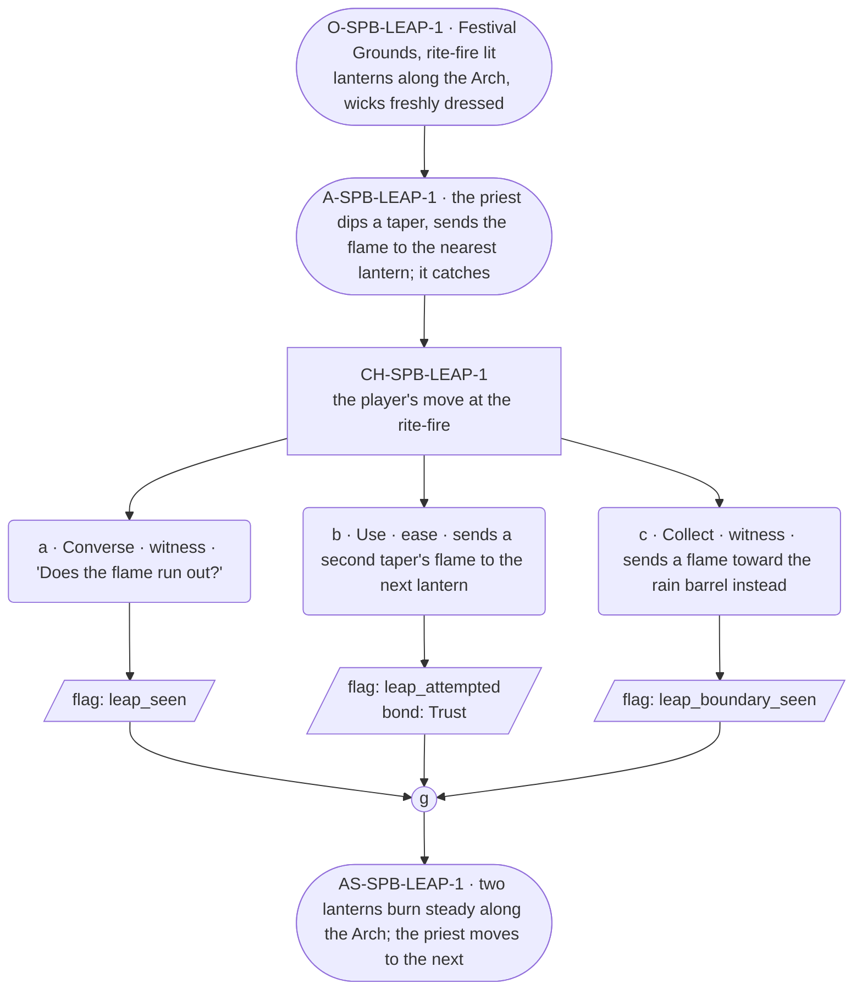

# SPB-leap — Priest spell beat: leap

## Part A — Mini Architect Brief

**Reveal carried:** First sight of `leap`, via the priest dipping a flame
from the rite-fire and sending it lantern to lantern up the Lantern Arch
(`content/magic/leap.json` `learn_source`). Component: `item_flame`
(spent on cast — the cast moves a flame that already exists). State-
dependent on `cold_lantern`: wick dressed for the rite, the flame takes;
wick bare, it dies.

**Role holder:** Walk-on — "the priest," named per register.md's walk-on
band.

**Sizing:** 6 beats — 2 setting beats, one 3-option choice node, one close.

**Constraint worth naming:** The component is a flame that already
exists — the priest isn't creating fire, only spending one. The clue is
the dip-and-send motion at the rite-fire, never a spoken instruction.

---

## Part B — Choice Designer Output

### Content block

**Incoming state (O-SPB-LEAP-1):** The Festival Grounds, rite-fire lit. A
row of lanterns along the Arch, wicks freshly dressed for tonight.

**A-SPB-LEAP-1:** The priest dips a taper into the rite-fire, then sends
the flame across to the nearest lantern in one motion — it catches and
holds steady.

**CH-SPB-LEAP-1 (3 options, ungated):**
- **a · Converse · witness** — `player_line`: "Does the flame run out?" —
  the priest: "Depends how far it's asked to go. One flame, one send."
  Records `knowledge_flag(leap_seen)`.
- **b · Use · ease** — `surface_action`: dips a second taper and sends it
  to the next lantern along the row — the wick's dressed, it catches.
  Records `knowledge_flag(leap_attempted)` + `bond_event(Trust, weight
  2)`.
- **c · Collect · witness** — `surface_action`: sends a flame toward the
  rain barrel at the edge of the grounds instead, out of curiosity — it
  lands on the water and goes out, the flame spent for nothing. Records
  `knowledge_flag(leap_boundary_seen)`.

Converges at **J-SPB-LEAP-1**.

**Close (AS-SPB-LEAP-1):** Two lanterns along the Arch now burn steady.
The priest moves down the row toward the next dressed wick.

**Action-slot ratio:** 2 action beats across the scene ≈ within range.

**Long-run placement:** None.

**Equal weight:** a explains, b tries and succeeds, c spends a flame on
the wrong receiver and finds the cost of a miss.

### Mermaid graph

**Self-verify:** parses clean, options match prose, genuine gather,
walk-on named and banded correctly, spent-flame component respected.
