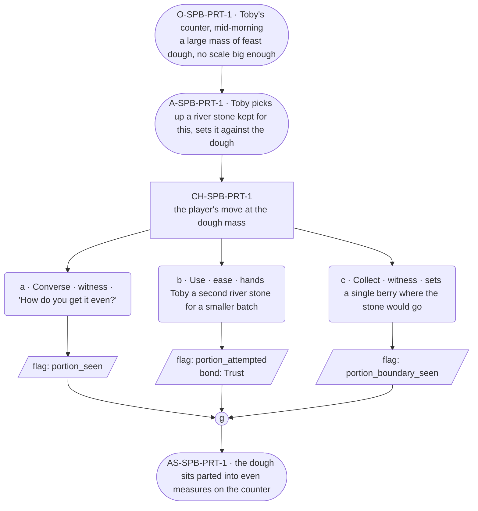

# SPB-portion — Baker spell beat: portion

## Part A — Mini Architect Brief

**Reveal carried:** First sight of `portion`, via Toby dividing the feast
batch at the counter (`content/magic/portion.json` `learn_source`).
Component: `item_river_stone`. Clean effect on `feast_dough_mass` (parts
into equal loaf-measures); no_effect on `single_berry` (too little to
divide).

**State:** Ordinary workday, generic — no thread material folded in
(the `toby-feast-short` pressure lives in `ENC-toby-*`, not here).

**Sizing:** 6 beats — 2 setting beats, one 3-option choice node, one close.

**Constraint worth naming:** Toby's card still governs his one dialogue
line here — fast, deflecting to the task, never elaborating past the
practical.

---

## Part B — Choice Designer Output

### Content block

**Incoming state (O-SPB-PRT-1):** Toby's counter, mid-morning. A large
mass of feast dough sits ready to be divided; no scale in the shop is
built for it.

**A-SPB-PRT-1:** Toby eyes the mass, picks up a river stone kept for
exactly this, sets it against the dough without a word wasted on the
setup.

**CH-SPB-PRT-1 (3 options, ungated):**
- **a · Converse · witness** — `player_line`: "How do you get it even?" —
  Toby: "Stone does that part." Fast, flat, already moving. Records
  `knowledge_flag(portion_seen)`.
- **b · Use · ease** — `surface_action`: hands Toby a second river stone
  to work a smaller batch the same way — it parts clean into matched
  measures. Records `knowledge_flag(portion_attempted)` + `bond_event
  (Trust, weight 2)`.
- **c · Collect · witness** — `surface_action`: picks up a single berry
  from a nearby bowl and sets it where the stone would go instead — too
  little there to divide into anything, nothing happens. Records
  `knowledge_flag(portion_boundary_seen)`.

Converges at **J-SPB-PRT-1**.

**Close (AS-SPB-PRT-1):** The dough sits parted into even measures on the
counter. Toby's already reaching for the next tray.

**Action-slot ratio:** 2 action beats across the scene ≈ within range.

**Long-run placement:** None.

**Equal weight:** a explains, b tries and succeeds, c finds the boundary
on too-little material.

### Mermaid graph

**Self-verify:** parses clean, options match prose, genuine gather,
component table respected, no phrase spoken as instruction.
