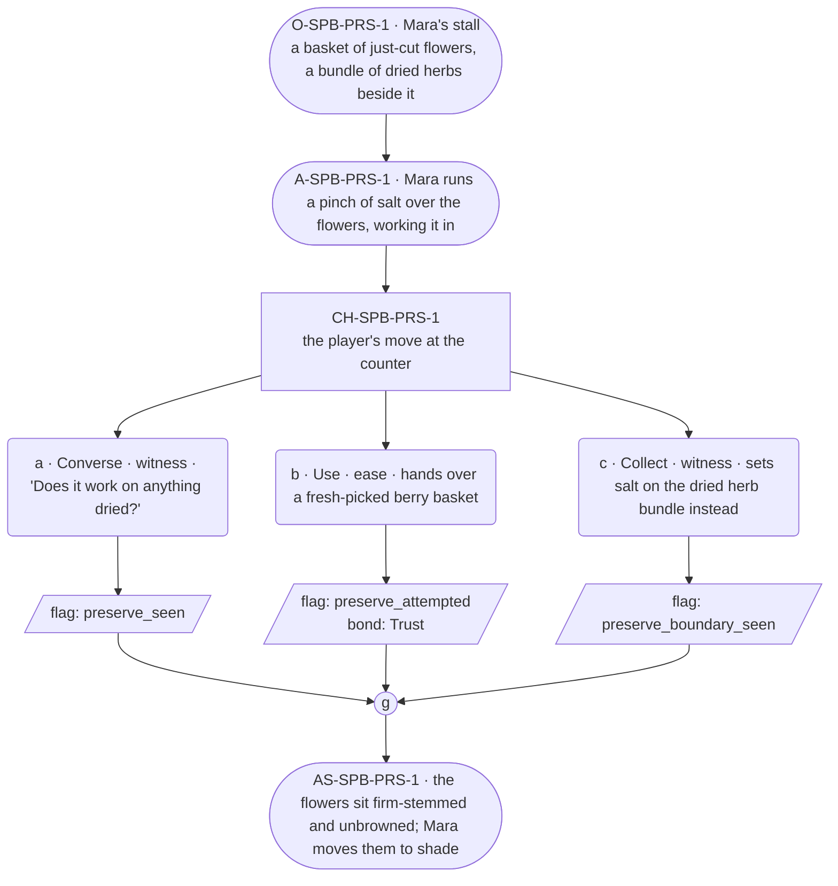

# SPB-preserve — Herbalist spell beat: preserve

## Part A — Mini Architect Brief

**Reveal carried:** First sight of `preserve`, via Mara laying cut herbs
by for the festival week (`content/magic/preserve.json` `learn_source`).
Component: `item_salt`. Clean effect on `cut_flowers`/fresh-picked things;
no_effect on `dried_herb_bundle` (already past fresh).

**State:** Ordinary workday, generic.

**Sizing:** 6 beats — 2 setting beats, one 3-option choice node, one close.

**Constraint worth naming:** No "remember/forget" language for how the
hold works — describe outcomes only (what stays fresh, what doesn't), per
her card canon flag 15.

---

## Part B — Choice Designer Output

### Content block

**Incoming state (O-SPB-PRS-1):** Mara's stall. A basket of just-cut
flowers sits beside a bundle of herbs already gone dry.

**A-SPB-PRS-1:** Mara runs a pinch of salt over the flowers, working it
in without ceremony — cut things need holding fast, before the day turns
them.

**CH-SPB-PRS-1 (3 options, ungated):**
- **a · Converse · witness** — `player_line`: "Does it work on anything
  dried?" — Mara: "No. Has to still be fresh." Records `knowledge_flag
  (preserve_seen)`.
- **b · Use · ease** — `surface_action`: hands over a fresh-picked
  berry basket for the same treatment — the berries hold at ripe.
  Records `knowledge_flag(preserve_attempted)` + `bond_event(Trust,
  weight 2)`.
- **c · Collect · witness** — `surface_action`: sets salt on the dried
  herb bundle instead, out of curiosity — nothing left to hold, no_effect.
  Records `knowledge_flag(preserve_boundary_seen)`.

Converges at **J-SPB-PRS-1**.

**Close (AS-SPB-PRS-1):** The flowers sit firm-stemmed, unbrowned, on the
counter. Mara moves them to the shaded end of the stall.

**Action-slot ratio:** 2 action beats across the scene ≈ within range.

**Long-run placement:** None.

**Equal weight:** a explains, b tries and succeeds, c tries the wrong
state (already past fresh) and finds the boundary.

### Mermaid graph

**Self-verify:** parses clean, options match prose, genuine gather,
component table respected, no banned vocabulary.
