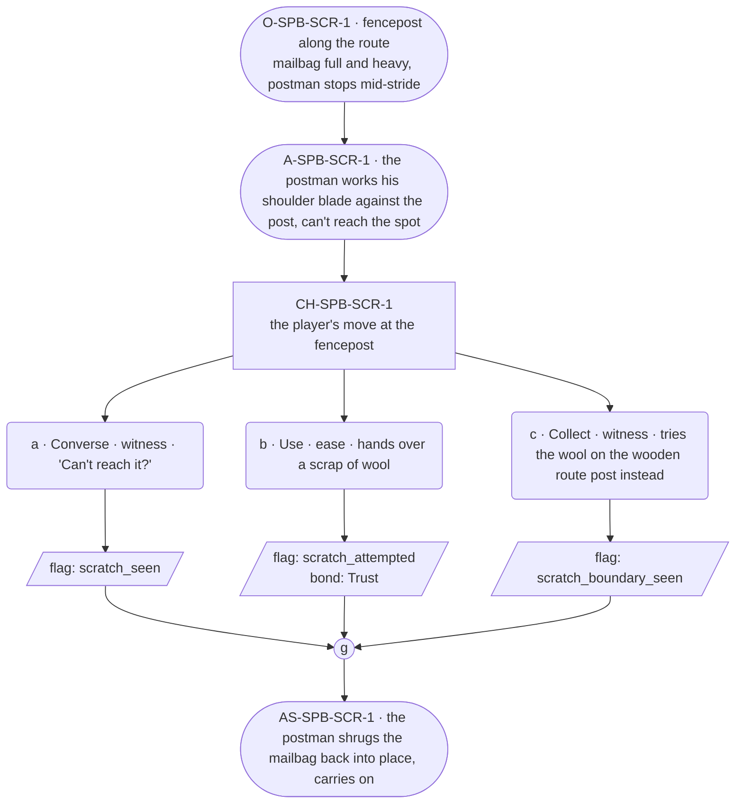

# SPB-scratch — Postman spell beat: scratch

## Part A — Mini Architect Brief

**Reveal carried:** First sight of `scratch`, via the postman pausing
mid-route under the full festival mailbag, casting on the strap-itch no
hand reaches (`content/magic/scratch.json` `learn_source`). Component:
`item_wool`. Canon starter spell, effect: soothes an itch in an
unreachable place — a bodily event, not a mood (per the magic index's
ruling that living receivers may be legal targets here specifically).

**Role holder:** No deep soul holds Postman this life — the holder is a
**walk-on** (named per register.md's walk-on band: no card, may explain
themselves, runs warmer and longer than a deep soul). Named in this
content block as "the postman"; Lines should write him in the walk-on
band, not a carded soul's register.

**State:** Ordinary route, generic.

**Sizing:** 6 beats — 2 setting beats, one 3-option choice node, one close.

**Constraint worth naming:** `scratch` is the one spell whose intended
receiver is alive — the physical-outcome rule is load-bearing here.
Relief of an itch is legal; contentment or gratitude is not, and whatever
the postman does about the relief belongs in the response as an observed
reaction, never a stated feeling.

---

## Part B — Choice Designer Output

### Content block

**Incoming state (O-SPB-SCR-1):** A fencepost along the route, festival
mailbag full and heavy. The postman stops, working one shoulder.

**A-SPB-SCR-1:** He works his shoulder blade against the post, can't
reach the spot, gives up and just holds still a second — a walk-on's
plain frustration, no deflection needed.

**CH-SPB-SCR-1 (3 options, ungated):**
- **a · Converse · witness** — `player_line`: "Can't reach it?" — the
  postman: "Right between the blades. Never can." Full sentence, warm,
  explains himself — walk-on band. Records `knowledge_flag(scratch_seen)`.
- **b · Use · ease** — `surface_action`: hands over a scrap of wool for
  him to work with — he settles it against the itch and it fades; his
  shoulders drop and roll once. Records `knowledge_flag
  (scratch_attempted)` + `bond_event(Trust, weight 2)`.
- **c · Collect · witness** — `surface_action`: tries the wool on the
  wooden route post instead, out of curiosity — nothing itches there,
  no_effect. Records `knowledge_flag(scratch_boundary_seen)`.

Converges at **J-SPB-SCR-1**.

**Close (AS-SPB-SCR-1):** The postman shrugs the mailbag back into place
and carries on down the lane.

**Action-slot ratio:** 2 action beats across the scene ≈ within range.

**Long-run placement:** None.

**Equal weight:** a explains, b relieves the itch (a bodily event, not a
mood — response stays physical), c tries an object and finds nothing
there.

### Mermaid graph

**Self-verify:** parses clean, options match prose, genuine gather,
walk-on named and banded correctly, physical-outcome rule respected
(relief only, no stated gratitude/mood).
