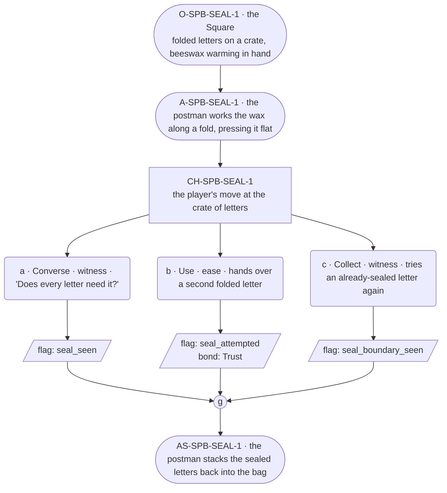

# SPB-seal — Postman spell beat: seal

## Part A — Mini Architect Brief

**Reveal carried:** First sight of `seal`, via the postman closing the
festival letters in the Square before his rounds (`content/magic/seal.json`
`learn_source`). Component: `item_beeswax`. Clean effect on `folded_letter`
(seals weather-tight); no_effect on `sealed_letter` (already closed).

**Role holder:** Walk-on — "the postman," named per register.md's walk-on
band.

**Sizing:** 6 beats — 2 setting beats, one 3-option choice node, one close.

**Constraint worth naming:** No spoken instruction — the clue is the
wax and the motion of pressing the fold shut.

---

## Part B — Choice Designer Output

### Content block

**Incoming state (O-SPB-SEAL-1):** The Square, a stack of folded letters
on a crate, a lump of beeswax warming in the postman's hand.

**A-SPB-SEAL-1:** He works the wax along a fold, pressing it flat — "A
letter that opens in the rain is a letter lost," he says, warm and
explaining, walk-on band.

**CH-SPB-SEAL-1 (3 options, ungated):**
- **a · Converse · witness** — `player_line`: "Does every letter need
  it?" — the postman: "Just the ones going out today. Rain's coming."
  Records `knowledge_flag(seal_seen)`.
- **b · Use · ease** — `surface_action`: hands over a second folded
  letter for the same treatment — it seals shut along the fold. Records
  `knowledge_flag(seal_attempted)` + `bond_event(Trust, weight 2)`.
- **c · Collect · witness** — `surface_action`: picks up an
  already-sealed letter and tries it again, out of curiosity — nothing
  changes, it's already closed. Records `knowledge_flag
  (seal_boundary_seen)`.

Converges at **J-SPB-SEAL-1**.

**Close (AS-SPB-SEAL-1):** The postman stacks the sealed letters back
into the bag, ready for the rounds.

**Action-slot ratio:** 2 action beats across the scene ≈ within range.

**Long-run placement:** None.

**Equal weight:** a explains, b tries and succeeds, c tries an already-
sealed letter and finds the boundary.

### Mermaid graph

**Self-verify:** parses clean, options match prose, genuine gather,
walk-on named and banded correctly.
