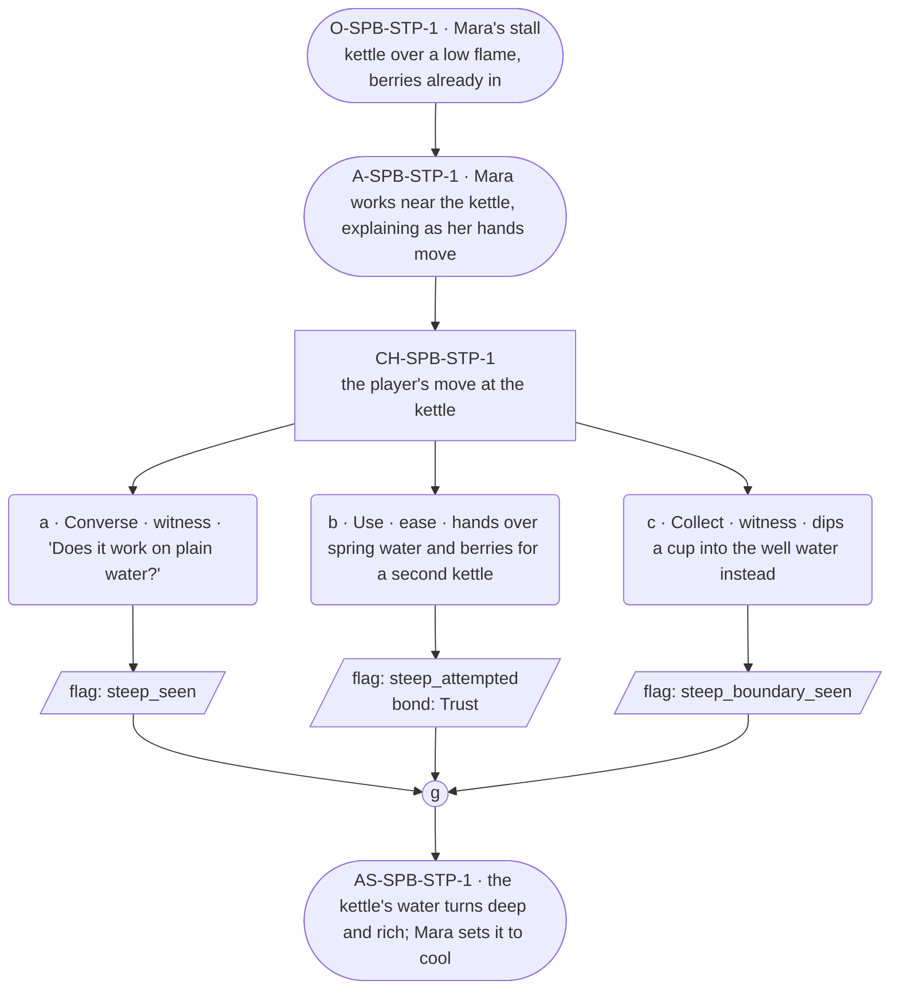

# SPB-steep — Herbalist spell beat: steep

## Part A — Mini Architect Brief

**Reveal carried:** First sight of `steep`, via Mara drawing a batch of
tonic (`content/magic/steep.json` `learn_source`). Components: `item_berry`
+ `item_spring_water`. State-dependent on `kettle_of_water` — with herbs
in it, the water takes color and virtue fast; plain, no_effect.

**State:** Ordinary workday, generic.

**Sizing:** 6 beats — 2 setting beats, one 3-option choice node, one close.

**Constraint worth naming:** Mara's ordinary line sits in her 20-50-word
band, not the village median — she explains while her hands work, which
is her warmth, per her `voice_register`. No "remember/forget" language
describing the draw.

---

## Part B — Choice Designer Output

### Content block

**Incoming state (O-SPB-STP-1):** Mara's stall. A kettle of water sits
over a low flame, berries already dropped in.

**A-SPB-STP-1:** Mara sets her hand near the kettle, explaining as she
works — the water takes the berries' color fast when the cast draws it,
slow otherwise, and either way it's better than waiting on the fire
alone.

**CH-SPB-STP-1 (3 options, ungated):**
- **a · Converse · witness** — `player_line`: "Does it work on plain
  water?" — Mara: "Not on its own. Needs something in it first." Records
  `knowledge_flag(steep_seen)`.
- **b · Use · ease** — `surface_action`: hands over a fresh skin of
  spring water and a handful of berries for a second kettle. The color
  takes in moments. Records `knowledge_flag(steep_attempted)` +
  `bond_event(Trust, weight 2)`.
- **c · Collect · witness** — `surface_action`: dips a cup straight into
  the well water instead, out of curiosity — it only takes a faint,
  unwanted discoloration from leaf-litter, not a real draw (per the
  `well_water` receiver). Records `knowledge_flag(steep_boundary_seen)`.

Converges at **J-SPB-STP-1**.

**Close (AS-SPB-STP-1):** The kettle's water turns deep and rich. Mara
lifts it off the flame, sets it to cool.

**Action-slot ratio:** 2 action beats across the scene ≈ within range.

**Long-run placement:** None marked — her uncapped licence is reserved
for provenance, not this beat.

**Equal weight:** a explains, b tries and succeeds, c tries the wrong
receiver and finds a near-miss rather than nothing.

### Mermaid graph

**Self-verify:** parses clean, options match prose, genuine gather,
component table respected, no banned vocabulary.
