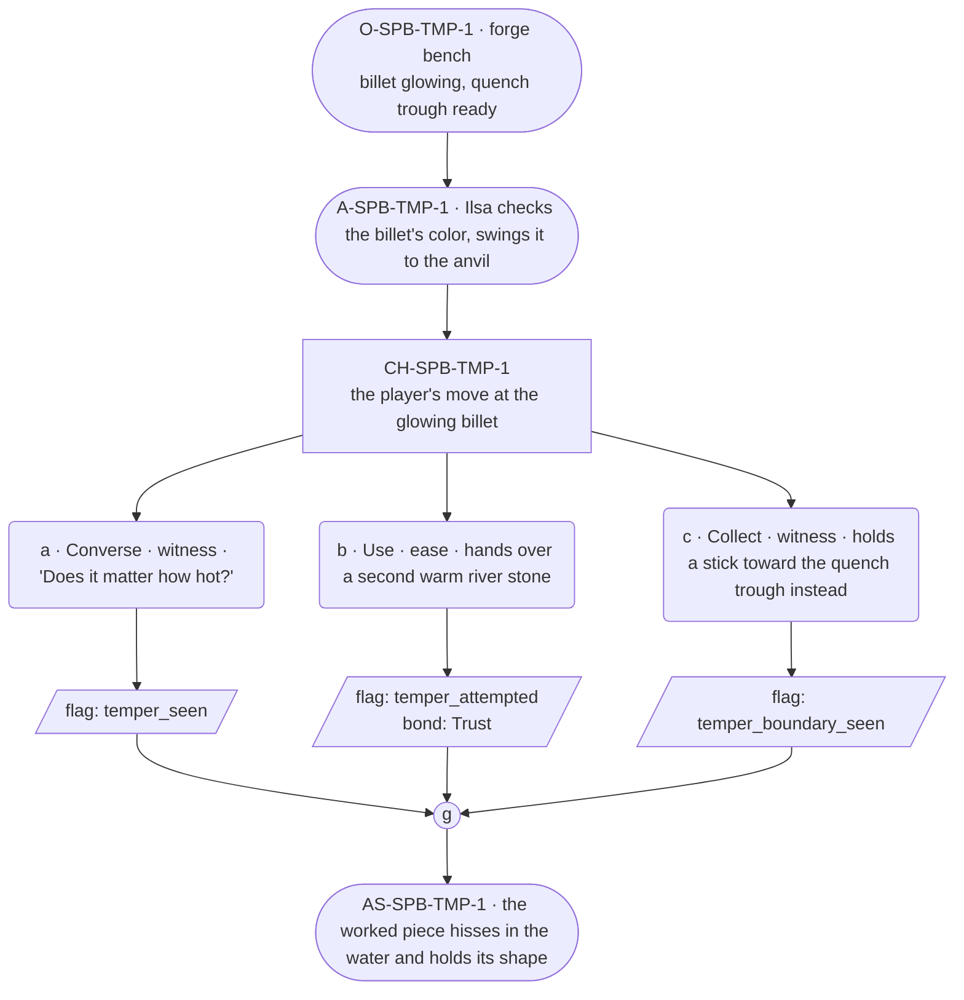

# SPB-temper — Blacksmith spell beat: temper

## Part A — Mini Architect Brief

**Reveal carried:** First sight of `temper`, via Ilsa quenching a glowing
piece at the bench (`content/magic/temper.json` `learn_source`).
Components: `item_river_stone` + `item_spring_water`. State-dependent on
the `forge_billet` receiver — glowing hot hardens evenly; cold, no_effect.

**State:** Ordinary workday, generic.

**Sizing:** 6 beats — 2 setting beats, one 3-option choice node, one close.

**Constraint worth naming:** The clue is the quench motion and the
state-dependence itself (has to be hot) — never a spoken phrase-as-
instruction.

---

## Part B — Choice Designer Output

### Content block

**Incoming state (O-SPB-TMP-1):** The forge bench. A billet glows from the
fire, tongs holding it steady. A trough of spring water sits ready beside
the anvil.

**A-SPB-TMP-1:** Ilsa turns the billet once more in the coals, checking
the color, then swings it to the anvil — the state-dependent clue: it has
to be hot for this to matter at all.

**CH-SPB-TMP-1 (3 options, ungated):**
- **a · Converse · witness** — `player_line`: "Does it matter how hot?" —
  Ilsa: "Glowing, not just warm." Flat, exact. Records `knowledge_flag
  (temper_seen)`.
- **b · Use · ease** — `surface_action`: hands over a second river stone,
  already sitting warm near the fire, for Ilsa to work on the same way.
  It hardens evenly under her hands. Records `knowledge_flag
  (temper_attempted)` + `bond_event(Trust, weight 2)`.
- **c · Collect · witness** — `surface_action`: picks up a stick lying
  nearby and holds it toward the quench trough instead — wood takes no
  temper, nothing happens (per the `stick` receiver's no_effect). Records
  `knowledge_flag(temper_boundary_seen)`.

Converges at **J-SPB-TMP-1**.

**Close (AS-SPB-TMP-1):** The worked piece hisses in the water and holds
its shape. Ilsa checks the edge with her thumb, sets it aside.

**Action-slot ratio:** 2 action beats across the scene ≈ within range.

**Long-run placement:** None.

**Equal weight:** a explains, b tries and succeeds, c finds the boundary
on the wrong material — all legitimate, none punished.

### Mermaid graph

**Self-verify:** parses clean, options match prose, genuine gather, no
phrase spoken as instruction, component table respected.
