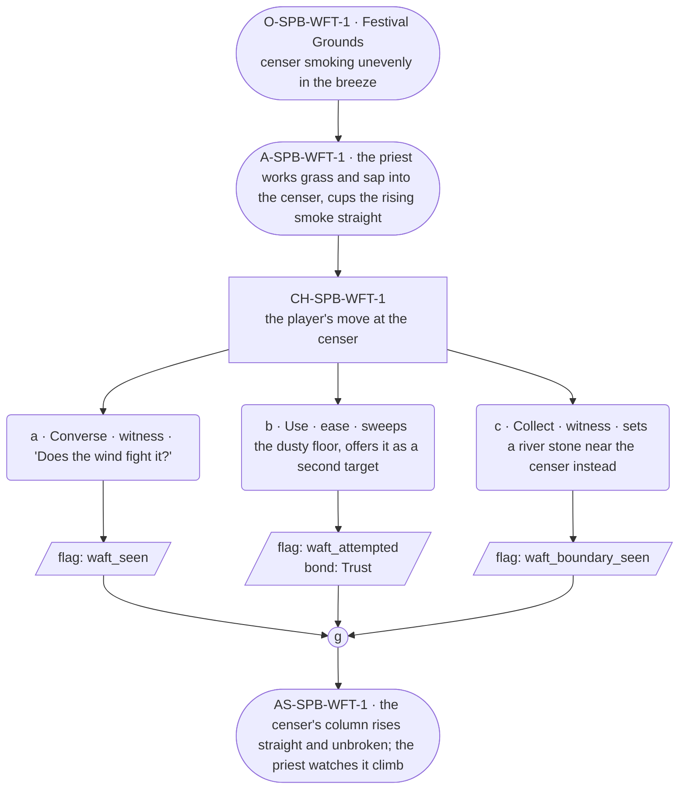

# SPB-waft — Priest spell beat: waft

## Part A — Mini Architect Brief

**Reveal carried:** First sight of `waft`, via the priest sending censer
smoke up straight at the Festival Grounds (`content/magic/waft.json`
`learn_source`). Components: `item_grass` + `item_tree_sap`. Clean effect
on `censer_smoke` (rises in a single straight column); no_effect on
`river_stone` (nothing about it can rise or drift).

**Role holder:** Walk-on — "the priest."

**Sizing:** 6 beats — 2 setting beats, one 3-option choice node, one close.

---

## Part B — Choice Designer Output

### Content block

**Incoming state (O-SPB-WFT-1):** The Festival Grounds, a censer smoking
unevenly in the breeze. The priest kneels beside it, unhurried.

**A-SPB-WFT-1:** He works grass and sap into the censer, cups his hands
around the rising smoke — it steadies and climbs straight, undisturbed by
the wind.

**CH-SPB-WFT-1 (3 options, ungated):**
- **a · Converse · witness** — `player_line`: "Does the wind fight it?" —
  the priest: "Not once it's called straight." Records `knowledge_flag
  (waft_seen)`.
- **b · Use · ease** — `surface_action`: sweeps the dusty floor near the
  censer, offering it as a second thing to lift — the dust rises in a
  thin sheet and drifts out the doorway. Records `knowledge_flag
  (waft_attempted)` + `bond_event(Trust, weight 2)`.
- **c · Collect · witness** — `surface_action`: sets a river stone near
  the censer instead, out of curiosity — nothing about it can rise or
  drift, no_effect. Records `knowledge_flag(waft_boundary_seen)`.

Converges at **J-SPB-WFT-1**.

**Close (AS-SPB-WFT-1):** The censer's column rises straight and unbroken
over the Grounds. The priest sits back, watching it climb.

**Action-slot ratio:** 2 action beats across the scene ≈ within range.

**Long-run placement:** None.

**Equal weight:** a explains, b tries a plausible receiver and succeeds,
c tries an inert stone and finds the boundary.

### Mermaid graph

**Self-verify:** parses clean, options match prose, genuine gather,
walk-on named and banded correctly.
