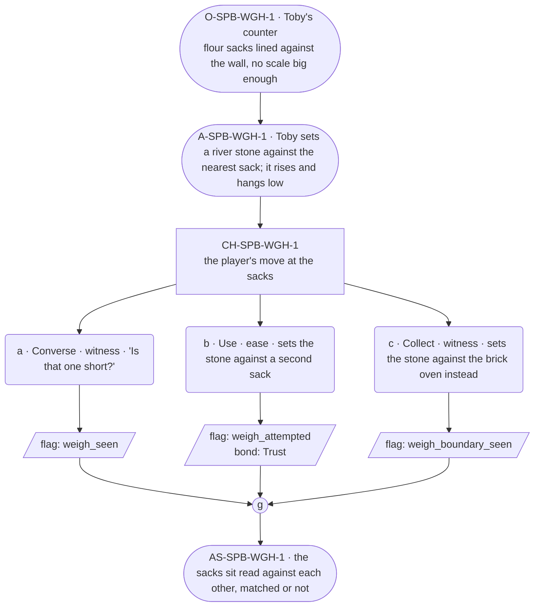

# SPB-weigh — Baker spell beat: weigh

## Part A — Mini Architect Brief

**Reveal carried:** First sight of `weigh`, via Toby settling the flour
sacks at the counter (`content/magic/weigh.json` `learn_source`).
Component: `item_river_stone`. Clean effect on `flour_sack` (hangs at a
height set by heft); no_effect on `brick_oven` (built into the floor,
nothing to bear up).

**State:** Ordinary workday, generic.

**Sizing:** 6 beats — 2 setting beats, one 3-option choice node, one close.

**Constraint worth naming:** Same discipline as `SPB-portion` — Toby stays
fast, exact about quantities (`precision_profile`), never elaborating.

---

## Part B — Choice Designer Output

### Content block

**Incoming state (O-SPB-WGH-1):** Toby's counter, flour sacks lined up
against the wall — no scale in town built for feast quantities.

**A-SPB-WGH-1:** Toby sets a river stone against the nearest sack. It
rises a hand's breadth and hangs — heavy, low.

**CH-SPB-WGH-1 (3 options, ungated):**
- **a · Converse · witness** — `player_line`: "Is that one short?" — Toby:
  "Hangs low. That's full." Fast, exact. Records `knowledge_flag
  (weigh_seen)`.
- **b · Use · ease** — `surface_action`: sets the stone against a second
  sack the same way — it hangs level with the first, matched. Records
  `knowledge_flag(weigh_attempted)` + `bond_event(Trust, weight 2)`.
- **c · Collect · witness** — `surface_action`: sets the stone against the
  brick oven instead, out of curiosity — built into the floor, nothing to
  bear up, no_effect. Records `knowledge_flag(weigh_boundary_seen)`.

Converges at **J-SPB-WGH-1**.

**Close (AS-SPB-WGH-1):** The sacks sit read against each other, matched
or not. Toby's already onto the next task.

**Action-slot ratio:** 2 action beats across the scene ≈ within range.

**Long-run placement:** None.

**Equal weight:** a explains, b tries and succeeds, c finds the boundary
on an immovable object.

### Mermaid graph

**Self-verify:** parses clean, options match prose, genuine gather,
component table respected.
