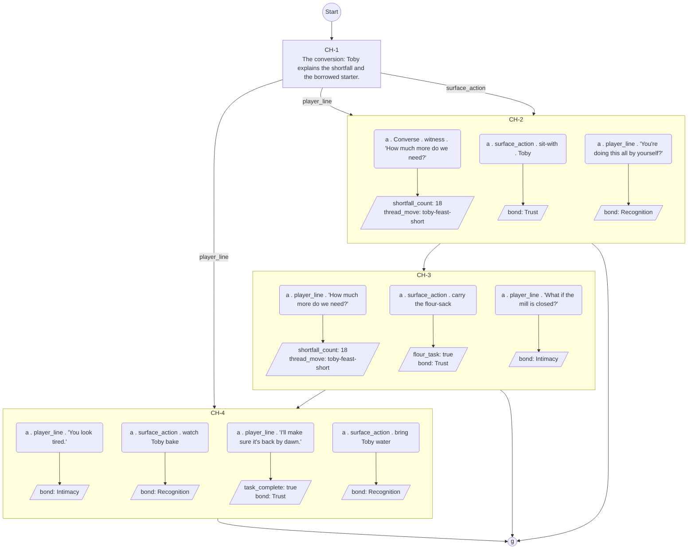

# Raw 26B output — Toby festival-arc C1, full Architect brief + Choice-designer graph

Model: `gemma4-26b-fiction-bf16.Q4_K_M.gguf`, `--moecpu 999`, koboldcpp,
temp 1.0 / top_p 1.0 / min_p 0.10, max_tokens 1800. Same combined brief as
the Claude trial (Toby's card, the ratified `toby-feast-short` registry row,
the arc doc's already-delivered canon, choice-node-schema basics, the
mermaid convention, and choice-designer.md's 22 rules condensed), blind to
`lantern-projects/v01/threads/toby-feast-short.md`.

## Raw response, verbatim, no edits

**PART A -- Narrative Architect Brief**

This conversation introduces the central tension of Toby's arc: the shortfall and his method of managing it. It establishes the "conversion" mechanic — the moment a crisis (the flat dough) is processed into a manageable task (borrowed starter and a specific number of missing loaves). The player walks in on the aftermath of his preemptive problem-solving. The conversation should be cold and functional, establishing his precision-profile (calculating the gap) and his deflection-target (turning the emotional weight of a "shortfall" into a logistical job for the player).

**Nodes:** 4-5.
**States:** Single entry (no prior facts).
**Constraints:** No long-run on emotional beats; long-run permitted only during the arithmetic of the shortfall.

***

**PART B -- Choice Designer Output**

**Content Block**

**Incoming State:** Toby is mid-calculation, surrounded by flour-dusted ledgers and a bowl of active, bubbling starter. The air smells of yeast and stress. He has already begun the math before the player arrives.

**Node CH-1 (The Conversion):** Toby explains the status of the feast. He has already secured a neighbor's starter to bridge the gap, but the math isn't closed.
- **Option 1 (player_line):** "How much more do we need?" [records: knowledge_flag(shortfall_count), thread_move(toby-feast-short)]
- **Option 2 (surface_action):** sit-with Toby [records: bond_event(Trust)]
- **Option 3 (player_line):** "You're doing this all by yourself?" [records: bond_event(Recognition)]

**Node CH-2 (The Calculation):** Toby provides the specific arithmetic of the shortfall.
- **Long-run (Logistics/Arithmetic):** "If the square turns out forty and we have twenty-two loaves on the bench, that's an eighteen-loaf deficit. With the neighbor's starter, we can double the rise, but we need the flour-milled from the north mill. If we get that by dusk, we can pull the last batch at dawn. It's tight, but the math holds if we don't sleep." (72 words)
- **Option 1 (surface_action):** carry the flour-sack [records: knowledge_flag(flour_task), bond_event(Trust)]
- **Option 2 (player_line):** "What if the mill is closed?" [records: bond_event(Intimacy)]

**Node CH-3 (The Hand-off):** Toby hands the player a specific, measured portion of the starter.
- **Option 1 (player_line):** "I'll make sure it's back by dawn." [records: knowledge_flag(task_complete), bond_event(Trust)]
- **Option 2 (surface_action):** watch Toby bake [records: bond_event(Recognition)]

**Node CH-4 (The Fatigue):** Toby's moment of vulnerability, masked by a task.
- **Option 1 (player_line):** "You look tired." [records: bond_event(Intimacy)]
- **Option 2 (surface_action):** bring Toby water [records: bond_event(Recognition)]

**Action-Slot Ratio:** 1:3
**Long-run Placement:** CH-2, during the arithmetic of the shortfall.

**Mermaid Diagram**

