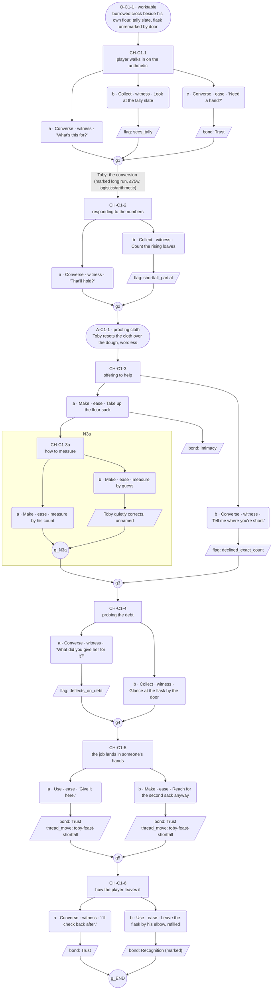

# Raw Claude output — Toby festival-arc C1, full Architect brief + Choice-designer graph

Engine: Claude (general-purpose subagent, blind — instructed not to read
`lantern-projects/v01/threads/toby-feast-short.md` or any file with
"feast-short" in its name). Same combined brief as the 26B trial.

## Raw response, verbatim, no edits

# PART A — Mini Architect Brief (C1)

**Reveal carried:** "The conversion" — first time the player sees Toby take a shortfall and turn it into arithmetic + a job before any feeling gets a chance to land. No prior facts assumed; the flat dough and the forty-loaf gap are established economy the player is expected to pick up cold, in-scene, not recalled.

**State of the shortfall:** Starter begged off a neighbor (offscreen, before scene opens) — the ask itself is not dramatized, only its aftermath: a borrowed crock sitting next to his own flour, tally marks already started. It covers *part* of the gap, not all of it — exact numbers ("twelve down from forty") are reserved for C2, so this scene stays deliberately vague on the remaining count.

**Sizing:** 6 choice nodes (seed default), one 3-option node for variance, one nested option (depth 2) — satisfies rule 16's "more than one device" floor for the thread as a whole.

**Constraint worth naming:** Must work stone cold — first likely contact with Toby all week. Zero gates, zero `knows()` predicates, one fallback state (the only state). No mention of the water-flask gesture as backstory — it can appear as an *examinable object* in the room (rule 6), never explained.

---

# PART B — Choice Designer Output

## Content block

**Incoming state (OS-C1-1):** Toby is at the worktable before the player has said anything. His own flour sack is open; beside it sits a crock that isn't his — someone else's culture, still faintly sour-smelling, lid balanced on top. A slate with chalk tally marks leans against the flour sack. He doesn't look up when the player enters. The refilled water flask from before sits by the door, unremarked.

**CH-C1-1 (3 options, ungated — the cold open):** The player reacts to walking in on this. *a)* `player_line` "What's this for?" (Converse/witness) — Toby answers without stopping his hands. *b)* `surface_action` Look at the tally slate (Collect/witness) — he angles it toward the player without comment, records `knowledge_flag(sees_tally)`. *c)* `player_line` "Need a hand?" (Converse/ease) — he hesitates a half-beat, then keeps working, records `bond_event(Trust, weight 2)`. All three converge at **J-1**, where Toby delivers the scene's one marked long run: the conversion itself — how he went and got the starter, what it buys, what it doesn't. (Logistics/arithmetic content; up to 75 words; placed here specifically, not at a receiving or payoff beat.)

**CH-C1-2 (2 options, ungated):** Response to the arithmetic. *a)* `player_line` "That'll hold?" (Converse/witness) — he gives a flat, honest "Some of it." *b)* `surface_action` Count the rising loaves nearby (Collect/witness) — he watches the player count, doesn't correct or confirm, records `knowledge_flag(shortfall_partial)`. Both feed **AS-C1-1**: Toby resets a proofing cloth over the dough, a small wordless action beat, no choice attached.

**CH-C1-3 (2 options, one nests):** Player offers to help directly. *a)* `surface_action` Take up the flour sack (Make/ease) — **nests** a depth-2 sub-node (CH-C1-3a: 2 options — measure by his count / measure by guess — both land on him quietly correcting the guess without naming it as correction, rejoining at `g_N3a`), records `bond_event(Intimacy, weight 2)`. *b)* `player_line` "Tell me where you're short." (Converse/witness) — he gives a number range, not the exact count (reserved for C2), records `knowledge_flag(declined_exact_count)`.

**CH-C1-4 (2 options, ungated):** Player probes the debt underneath the favor. *a)* `player_line` "What did you give her for it?" (Converse/witness) — he deflects onto the unfinished task in the room ("Ask me after the second proof"), records `knowledge_flag(deflects_on_debt)` — a flag with no reader yet in this conversation, intended for C3/C4 payoff on the conviction line. *b)* `surface_action` Glance at the flask by the door (Collect/witness) — he doesn't follow the player's eyeline, records nothing (the object stays closed — rule 6 satisfied: the flask is named as an examinable that would reopen the gesture, not explained here).

**CH-C1-5 (2 options, ungated):** He hands off a job before distress can register. *a)* `player_line` "Give it here." (Use/ease) — takes the job, records `bond_event(Trust, weight 2)` + `thread_move(toby-feast-shortfall)`. *b)* `surface_action` Reach for the second sack anyway (Make/ease) — takes initiative unasked, records `bond_event(Trust, weight 2)` + `thread_move(toby-feast-shortfall)`. Both equal weight, both move the thread — the move is the conversion completing, not which option was picked.

**CH-C1-6 (2 options, ungated — the close):** How the player leaves it. *a)* `player_line` "I'll check back after." (Converse/witness) — flat acknowledgment, records `bond_event(Trust, weight 2)`. *b)* `surface_action` Leave the flask by his elbow, refilled (Use/ease) — the deep/marked pick, mirroring his own earlier unprompted gesture back at him; he stops for exactly one beat, doesn't name it, records `bond_event(Recognition, weight 3)`. Converges at **J-END**.

**Action-slot ratio:** 2 object/action beats (OS-C1-1, AS-C1-1) across 6 choice nodes ≈ 1 per 3 — inside the stated 1-per-3-to-5 range.

**Long-run placement:** One marked long run (up to 75 words), placed at J-1 as Toby's arithmetic explanation — a logistics/instruction beat, not a receiving/thanked/seen or payoff beat. No other long run in the scene.

## Mermaid graph

