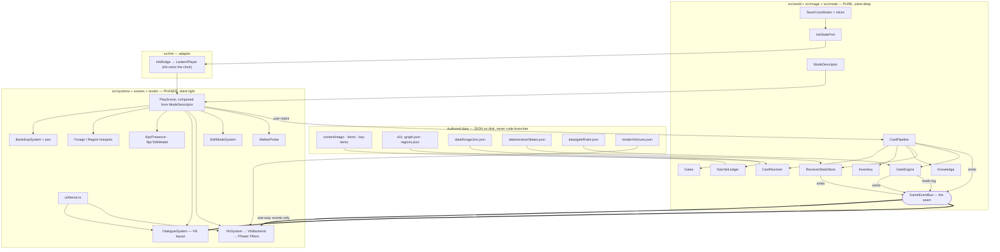

# Pivot to Phaser — feature-complete for the 2026-08-25 capstone

## Context

The game-project was building its shippable slice in Unreal. That track hit real friction: the save system and the ink integration both stalled, and the 2026-08-12 session logs are a catalogue of tooling tax — blocking modals freezing the MCP channel, two Inkpot APIs returning success while doing nothing, PIE state queries returning stale values, a Live Coding trap that emptied a `static const`, three editor restarts in one night.

Investigation found the deeper cause. **The Unreal snags are not ink problems — they are a missing host layer.** `tools/lantern/src/lib/play.ts` (`LanternPlayer`) owns the satchel, day loop, move budget, pack-triage and NPC presence. The resolver declares this deliberately: `tools/resolver/src/graph.ts:195` marks `present_<soul>` as written by `DAY_START_WRITER`, a *host* writer, and the emitted ink only ever reads it. Phaser works because it imports `LanternPlayer` through a Vite alias. Unreal does not work because `RebirthCore` reimplemented parts of that layer from scratch and never ported `applyPresence`.

This corrects two records: the 2026-08-12 Unreal summary concluded "nothing anywhere writes `present_<soul>`, so this is an ink gap" and opened Task #157 asking resolver-side vs UE-side — the answer already exists (host-side, reference implementation at `play.ts:358`). And `phaser/GAPS.md` G15's "just regenerate v01" is incomplete, because the ink was never supposed to write presence.

**Roc ruled 2026-08-16: pivot. Phaser is the ship target for the capstone. Unreal becomes post-capstone.** The Unreal work is not lost — Step 0, the 205-tag table, `gen_datatables.py` and `RebirthCore` all survive as the port target.

**Roc also amended the Definition of Done:** save/restore, one week playable, soul storylines complete. **Reshuffle is dropped.**

Outcome intended: a Phaser build that meets the amended DoD by Tue 2026-08-25, with gate-enforced traversal, working magic chains, spell VFX, an in-game edit mode, and standalone tools for approving content and tracking assets.

---

## Rulings captured this session

| Item | Ruling |
|---|---|
| Ship target | Phaser. Unreal post-capstone |
| Definition of Done | save/restore + one week playable + soul storylines complete. **Reshuffle dropped** |
| G-F5-cascade (F5→F6,F7) | cleared by `ignite` |
| G-F7-light (F7) | cleared by `glimmer` |
| G-T5-trust (T5) | bond level = medium |
| G-T6-evening (T6) | time-of-day == evening |
| G-F4-still (F4) | two-spell chain: `ignite` a river stone → `temper` it. **The teaching instance** |
| G-F8-combine (F8) | three-spell chain: `ignite` a river stone → `fetch` it into the stone wall → `temper` it. **The test instance** |
| Gate enforcement | ON. Knowledge stays the reward mechanic |
| Magic depth | Bind receivers to screens; deepen the matrix. **No new spells** |
| Spell VFX | Native Phaser 4 filters + particles. **enable3d rejected** (Phaser 3 only) |
| Asset creation | Blender + ComfyUI |
| Edit mode | All three: hotspot drawing, lock toggle, story-beat insertion |
| Spell/item approval table | Approved. Separate runnable, Lantern theming |
| **Bond bands** | 2026-07-30 ruling **retired**. One attentive life may reach HIGH |
| **Lantern save** | `saveSnapshot`/`loadSnapshot` may be added to `tools/lantern/src/lib/play.ts` |
| **Modes 1–3 gates** | Keep `legacy-hedge`. Only Mode 4 uses the authored rulings |
| **3D lock** | **Amended.** 3D remains the target; the capstone ships 2D backdrops |

**Gate reachability verified.** `ignite` needs `item_sticks` (F1, flagged `always_available`). `glimmer` and `temper` need `item_river_stone` (F2). `temper` also needs `item_spring_water` (T1). All components forage from unlocked start screens, so no gate is circular.

### Why F4 and F8 share verbs on purpose

F4 is the player's first chain and sits one screen from its components (F2 The Stream forages river stones, and F2 is F4's only neighbour). F8 asks the player to recall that grammar and add one step — the `fetch` into a socket. Teach, then test.

**F8 also instantiates its original spec rather than re-keying it.** `G-F8-combine` was authored as *"Laki combine — two fragments, neither sufficient alone"* with the fragments unenumerated. The stone and the wall are the two fragments.

### The chain is already the schema, not new machinery

`temper × forge_billet` is authored verbatim as: *"State-dependent: glowing hot, it hardens evenly with a hiss and holds its shape; already cold, no_effect — there is no heat to set."* That is the mechanic, already written. **18 spell×receiver pairs carry `receiver_class: "stateful"` with both branches authored, and nothing anywhere tracks receiver state.** Closing that gap unlocks 18 already-paid-for interactions plus both chain gates.

---

## Blocker that ordering must respect

Enforcing gates promotes `phaser/GAPS.md` G13 to critical path.

Forage pools and item records are two vocabularies that do not join:

```
F2 forage pool:   ["river stones"]     ← what you pick up
glimmer needs:     item_river_stone     ← what casting matches on
```

Different strings, no mapping. Today this is invisible because gates are advisory and every screen is walkable. **The moment gates are enforced, the forest becomes unreachable.** The pool→item map must land before any gate ships.

It gets worse in detail: `item_river_stone`'s own record claims sources "Forager's Clearing" and "Forest Unlock 2", but F1's actual pool has no river stones and "Forest Unlock 2" is not a screen name. F4 and F7's pools are literally `["rare component"]` and `["deep component"]`.

---

## NPC conversation UI — layout from the references

From `C:\Users\rocle\Desktop\8-16-refs`. **Copy the layout, not the art style.**

```
┌────────────────────────────────────────────────┐
│                                                │
│              [ character sprite ]              │  centered, full-height,
│                over backdrop                   │  over the screen backdrop
│                                                │
│        ┌──────────────────────────────┐        │
│        │        Go right              │        │  choices: stacked pills,
│        ├──────────────────────────────┤        │  centered, ABOVE the box,
│        │        Go left               │        │  hover = lighter fill
│        └──────────────────────────────┘        │
│                                                │
│            ╭─────────────╮                     │
│      ┌─────┤   Eleanor   ├───────────────┐     │  nameplate pill sits ON
│      │     ╰─────────────╯               │     │  the box's top edge,
│      │  I guess we won't find a rare     │     │  centered. Absent for
│      │  bird so quickly, right?          │     │  narration.
│      └───────────────────────────────────┘     │
│                                                │
│   [Auto] [Skip] [Log] [Hide UI] [Options]      │  persistent control bar
└────────────────────────────────────────────────┘
```

Structural rules read off the four references:

- Dialogue box is bottom-centre, ~65% width, semi-transparent dark panel, rounded, subtle border.
- Speaker nameplate is a **pill overlapping the box's top edge**, centre-aligned. Present only when a soul speaks.
- Dialogue text is **centred**. Narration and description are **left-aligned with no nameplate and no sprite** (`when-alone-thoughts-and-descriptions.jpg`).
- Choices float **above** the box as stacked full-width pills. The box stays visible underneath showing the prompting line.
- Control bar sits below the box, always present.

This replaces the current layout, where choices are a horizontal row above the satchel bar and NPC portraits sit on a baseline (`plans/2026-08-13-mode3-and-followups-handoff.md` §1).

Colours come from `phaser/src/ui/theme.ts`, which is already WCAG-contrast-checked. Do not introduce new colour values.

---

## Agents — what icm-architect actually implies

Roc asked for agents owning save state, receiver state, VFX and documentation. Both governing sources say **do not do that**.

`P:\GitHub\icm-architect` is explicit: *"One agent, reading the right files at the right moment, replaces a multi-agent framework."* Its unit of ownership is **a folder plus a `CONTEXT.md`**, not a persona. It has no concept of a seat, an agent contract, or a named persona.

The project's own `agents/README.md` agrees: *"A new seat needs a clear, distinct why and a passing capability check — not a guess that 'an agent could help'. Absorption beats proliferation."* And it sets the precedent for deterministic work: *"A fourth check is deterministic and is not a seat."*

So the proposal is **three tiers, not four agents**.

### Tier 1 — domain ownership is a folder contract, not a seat

Each new system folder gets a `CONTEXT.md` in icm-architect's stage-contract shape: **One job · Inputs (working vs reference, exact paths) · Do NOT load · Process · Outputs · Human check**. That is what "owns" save state, receiver state and VFX. It is reviewable by `ls`, costs no tokens at runtime, and is what lets two sessions work in parallel without collision.

### Tier 2 — two genuine new seats

Both pass the capability check because their load is distinct, recurring, and spans weeks.

**1. Systems Documentarian** (`agents/systems-documentarian.md`)
- **Feature owned:** the architecture record — the mermaid graph and the module/interface table, regenerated from what is actually on disk.
- **When called:** at each stage boundary, and after any module gains or loses a public interface.
- **Why a seat and not a script:** a script can list files; deciding which seams are load-bearing enough to draw is judgment. The *drift check* underneath it (does every module in `src/world/` appear in the diagram?) is deterministic and ships as part of the audit script.
- **Escape hatch:** `undocumented[]` — modules it could not place.

**2. Assignment Scout** (`agents/assignment-scout.md`)
- **Feature owned:** candidate work toward future course assignments, and the **before** half of every before/after.
- **When called:** at the end of any session that built or changed something.
- **Why a seat:** the survey of `P:\GitHub\game-design-course` shows the signature of a finished assignment is (a) a README answering the brief's questions as literal headings, (b) every mechanism claim backed by a verbatim code fence or run output, (c) **at least one before/after with provenance and a date**, (d) a replayable command, (e) an honest-limits section. A "before" cannot be reconstructed after it is overwritten — it has to be captured as it happens. That is a distinct, time-bound load no existing seat carries.
- **Writes to:** `assignments/_candidates/` in this repo, never to `game-design-course` (that repo holds submitted work only).
- **Escape hatch:** `needs_roc[]` — candidates it cannot map to a brief.

### Tier 3 — deterministic, so a script

`npm run orphans` — content authored but wired to nothing. Not a seat, by the same reasoning that keeps `content-check.mjs` a script.

Both new contracts must pass `agents/contract-audit.md` before first use, and must carry the `## Why these rules` rationale-split block the rubric requires.

---

## Assignment candidate tracking

New directory `assignments/_candidates/`, one file per candidate, written by the Assignment Scout.

Shape follows what the course repo shows works:

```markdown
---
candidate: <slug>
date: YYYY-MM-DD
possible_assignment: "#8 narrative engine prototype | #9 adversarial QA | #10 pipeline docs"
status: candidate | promoted | dropped
---

# <what was built>

## The brief question it answers
## What was built (verbatim command + code fence)
## BEFORE  — <provenance: file path + date, captured live>
## AFTER   — <what changed, or "none">
## Evidence — run log / fixture / screenshot paths
## Honest limits
```

Immediate candidates from this plan: the content audit script (#9 adversarial QA — a structured-report testing agent), the edit mode and approval table (#10 end-to-end pipeline documentation), and the receiver-state system (#8 narrative engine prototype).

---

## Mode 4 — the integrated build

**Roc, 2026-08-17: this build is Mode 4 in Phaser, the final version before the capstone, bringing all features together.**

Existing modes and how they were built:

| Mode | Flag | Scene | How it was added |
|---|---|---|---|
| 1 Day Life | `?mode=daylife` | `ScreenScene` | original |
| 2 Collection & Discovery | `?mode=collect` | `CollectScene` | new scene, 2026-08-13 |
| 3 Discovery & Home | `?mode=discover-home` | `CollectScene` + `hubEnabled` | a boolean threaded through `ModePickerScene → PreloadScene → LocationSelectScene → CollectScene` |

**Mode 4 is where that pattern breaks.** Mode 3 was cheap because it added one boolean. Mode 4 adds gate enforcement, receiver state, save/load, VFX, the VN dialogue layout and edit mode. Threading six more flags through the same chain turns `CollectScene` into a god object — which is exactly what the SRP requirement forbids.

**So Mode 4 is not a fourth flag on `CollectScene`. It is the mode that proves the extraction.** The shared engine comes out of `CollectScene` into composable systems under `src/world/` and `src/render/`, and every mode — including the three that already exist — becomes a thin composition over those systems. Mode 4 composes all of them.

That extraction is the same work as the SRP/parallel-work requirement, so it is not extra cost. It is the cost, paid once, in the place that makes the remaining features additive rather than multiplicative.

**Regression bar:** modes 1–3 must still run after the extraction. `npm run walk`, `npm run sweep` and the vitest suite are the proof, and they must pass before any Mode 4 feature lands on top.

---

## Gate ownership — ruled

**The host owns gate state and decides when a gate clears. Ink reads it through an external function.**

Ink cannot own the decision: it has no concept of a spell (zero matches for `cast|spell|ignite|mana` across all 22 `.ink` files), and moving casting into ink means 89 receiver outcomes in the story graph plus an inklecate recompile on every content edit. The probe already rejected that.

But ink must be able to *read* the fact, because Roc requires NPCs reacting to gates opening and that set will grow. The mechanism is the one ink is designed for and this project already uses four times:

```ink
EXTERNAL gateCleared(gate_id)
{gateCleared("G-F7-light"): Toby mentions the cave is open.}
```

**Rejected: `LIST GatesCleared` (`phaser/GAPS.md` G4).** Heavier — per-gate LIST members, declared in the generated `state.ink`, needing a regen whenever gate ids change. The external is declared once and then serves unlimited reactions with no further resolver work.

**Rejected: host-side reaction lines.** Fine for one line, wrong for a growing set. Every new reaction would be a TypeScript case rather than a thread-file edit — engineering work per line instead of content work. `CollectScene.shareClueOnFirstTalk()` is the precedent and it is deliberately not extended here.

`tools/resolver/src/walk.ts`'s JS ink-simulator must bind `gateCleared` too, or the resolver's own tests break.

---

## The resolver — repair, then one regen

**Correction to an earlier assumption in this plan.** The 2026-08-13 handoff records "a pre-existing failure" (singular, `seedThreadsFromContent`). Running the suite shows **nine failures across two files**, and reading them shows neither cluster is broken logic:

**`tuning.test.ts` — 2 failures. Superseded by a new ruling, not a fix.** The tests assert Roc's 2026-07-30 ruling — *one attentive life earns MID, HIGH needs a second life.* **Roc retired that ruling on 2026-08-17: one attentive life may now reach HIGH.**

So these two tests are not broken. They correctly enforce a ruling that no longer stands, and they must be **re-specified**, not repaired. See *The bond ruling change* below.

**`walk.test.ts` — 7 failures, a search budget.** *"search bound hit, so the unreachable lists are INCONCLUSIVE"* and *"SC-T2-04 was never explored inside the search budget."* These do not say scenes are unreachable. They say the exhaustive week-search ran out of room before it could prove reachability, and the test is correctly refusing to read a truncated search as proof. The cause is content growth — Toby's thread now runs SC-T2-04 through SC-T2-25 in a chain of `played(X)` gates. Fix by raising the bound, memoising, or accepting a sampled search with an honest label.

### The bond ruling change — ruled 2026-08-17

**Retired:** *one attentive life earns MID, HIGH needs a second life* (ruled 2026-07-30, restored 2026-08-07).
**New:** one attentive life may reach HIGH.

**Why it is coherent with the pivot.** Reshuffle came out of the DoD the same day, so the second-life payoff is not being demonstrated at the capstone. Under the old ruling, high-band authored content was unreachable in a single playthrough — which is all a demo gets. The change makes content you already paid for visible on demo day.

**It also ends a treadmill.** `high_min` had been re-sized twice to keep the old ruling true as content grew (36 on 2026-07-31, 82 on 2026-08-07), and Toby now walks 174 against a bar of 82. A third resize would have been the same move a third time.

**What it costs, stated once.** `gdd/12-technical-overview.md`'s Reciprocity row keeps its minimum bar — *bond persists across lives* — but loses headroom against its target, *dialogue visibly warms over repeated lives*. There are three bands. If life 1 reaches HIGH, lives 2+ have nowhere to climb. That is a real narrowing of what a second life is for, and it goes on the gdd-sync list.

**What has to happen, mechanically:**

1. **Both thresholds re-size, not just `high_min`.** `mid_min` is 12, sized when an attentive life yielded ~24. Against a 174 ceiling it is now about 7% of a life, so MID would clear almost immediately and the bands would stop meaning anything.
2. **Ilsa is the binding constraint, and GP-21 is now load-bearing.** Walked ceilings are Toby 174, Mara 128, **Ilsa 114** — and her `trait_coefficient` is 0.7 because *"a guarded soul's bond moves slower."* Thresholds are global. Set `high_min` for Toby and Ilsa may never reach HIGH, which reinstates the old problem for one soul. GP-21 (Ilsa's lower-bound break) was carried on a 2026-08-10 *"leave it"* and **was not settled this session** — it now blocks the resize. **First thing to bring Roc with real numbers.**
3. **`demo_multiplier` becomes redundant.** Its note says it exists to "reach high inside one life for demonstration." That is now the real bar. Flag for cleanup, do not silently delete.
4. **Rewrite both `tuning.test.ts` cases** to assert the new ruling, with the ruling and its date in the test name, matching the existing convention.

### The regen is deterministic — a second correction

`tools/resolver/src/seed.ts` states the rule: *"the day's seed is SHA-256 of `slot|life|day`. **Reloading a day re-rolls nothing.**"*

So re-running the build does **not** shuffle placements or move reviewed lines. Same inputs, same output. The earlier warning in this plan that "a regen changes seeds and placements" was wrong as a general claim — that risk exists exactly **once**, because the current `v01` was built 2026-08-01 from inputs that have changed since. One regen absorbs 16 days of input drift. Every regen after that is boring.

### One regen does three jobs

1. **Unblocks soul storylines** — `GAPS.md` G15 and `phaser/HANDOFF.md` both name regenerating `v01` as *"the one thing that matters next"*, and it is why Ilsa's and Mara's conversations appear unreachable. This is the DoD item **soul storylines complete**, already stale for 16 days.
2. **Enables ink-authored gate reactions** — the `gateCleared` external.
3. **Resets the authoring loop to cheap** — deterministic, and the search-budget fix keeps it fast as threads grow.

### The ongoing authoring loop, after this

Scene content lives in `tools/resolver/data/scene-graph.json` (34 scenes), authored via `lantern-projects/v01/threads/`. Adding a reaction is then:

```bash
cd tools/resolver && node src/cli.ts build --data data --out ../../lantern-projects/v01 --emit-story
cd ../../phaser && npm run prep:content
```

No ceremony per line.

---

## Architecture

Full design in the sections below. Two corrections to earlier assumptions, both from reading the code:

- **`src/world/foragePoolToItem.ts` already exists** and is near-complete: 13 entries covering every pool string in `graph.json`, and `tests/CollectMode.test.ts:28` already asserts every pool maps to a real `item_id`. **P1 is ratification, not construction** — move the guesses into an authored JSON file carrying provenance.
- **A live bug the chains would have hit.** `readsAsNoEffect` is anchored with `/^no (physical )?effect\b/i`, but stateful branches embed the marker mid-string (*"…already cold, no_effect — there is no heat to set"*). So `temper × forge_billet` resolves as an **effect** today and mints its `produces` regardless of state. Branch selection must run before the no-effect test.

### Tiers, and the one rule that holds the line

```
src/world/**    pure — no Phaser, no DOM, no fetch.   vitest deep
src/mode/**     pure — mode descriptors (data)
src/systems/**  Phaser-aware, scene-agnostic          vitest light
src/scenes/**   thin composition only
src/render/**   Phaser render helpers + authored cue tables
```

**`src/world/**` may never `import Phaser`.** Enforced by a vitest that greps the sources. Cheap, and it is the only thing that will actually hold across parallel sessions.

### The seam — one file, written first

`src/world/events/GameEvents.ts` — a **pure** `GameEventBus`, deliberately not `Phaser.Events.EventEmitter` (today's only bus is `InkBridge`, which extends Phaser's and so is render-coupled).

Event types: `cast:resolved` · `cast:rejected` · `craft:started|completed|abandoned` · `receiver:state-changed` · `gate:cleared|blocked` · `item:acquired|consumed` · `screen:changed` · `dialogue:line` · `save:written|loaded`.

The bus keeps an **ordered log**, which the chain gates, the walker and the audit all read.

### Modules, one responsibility each

| Module | Owns |
|---|---|
| `world/data/forageJoin.json` + `foragePoolToItem.ts` | pool name → `item_id`, authored with provenance |
| `world/receivers/ReceiverStateStore.ts` + `data/receiverStates.json` | which state each receiver is in |
| `world/gates/GateRule.ts` · `GateEvaluator.ts` · `GateEngine.ts` + `data/gateRules.json` | what clears a gate |
| `world/CastPipeline.ts` | resolve → bookkeeping → state transition → gate refresh → emit |
| `world/SatchelLedger.ts` | satchel/consumed reconciliation (today an untested private method) |
| `world/save/**` | `SaveGame` schema, `SaveCoordinator`, per-system `SaveSlice`s, `SaveStore` |
| `world/view/PanModel.ts` · `HotspotPlacement.ts` · `DialoguePlayback.ts` | pure math behind the render |
| `render/vfx/VfxSystem.ts` + `cues.json` | GameEvent → Phaser filter/particle |
| `systems/DialogueSystem.ts` | the VN layout |
| `world/audit/rules.ts` + `tools/content-audit.mjs` | content authored but wired to nothing |

**All six gate rulings are data, no code branches:**

```jsonc
{ "G-F5-cascade": { "kind":"cast", "spellId":"ignite",  "requireEffect":true },
  "G-F7-light":   { "kind":"cast", "spellId":"glimmer", "requireEffect":true },
  "G-T5-trust":   { "kind":"bond", "minBand":1 },
  "G-T6-evening": { "kind":"time", "blocks":["evening"] },
  "G-F4-still":   { "kind":"chain", "steps":[
      {"spellId":"ignite","receiverId":"river_stone"},
      {"spellId":"temper","onProductOf":0}] },
  "G-F8-combine": { "kind":"chain", "steps":[
      {"spellId":"ignite","receiverId":"river_stone"},
      {"spellId":"fetch","receiverId":"stone_wall","requiresHeld":"item_river_stone"},
      {"spellId":"temper","onProductOf":0}] } }
```

A `chain` matches an ordered subsequence over the cast log with product binding. `GateEngine` **refuses to load a rule naming an unauthored spell or receiver** rather than silently never clearing.

### Receiver state — the branch text is copied, never parsed

All 29 stateful outcomes share the shape `"State-dependent: A; B"`, so a regex split looks trivial. Several branches contain their own semicolons and em-dashes. Splitting by pattern is exactly the *inferred, not authored* failure the forage join was called out for.

So branch clauses are **copied verbatim by a human** into `receiverStates.json`, and a vitest guard asserts each clause is a substring of the record's `physical_outcome`. Content drift fails a test instead of rendering the wrong branch.

### Mode 4 — dismantling the flag chain

`CollectScene.ts` is 1021 lines carrying **eleven** responsibilities. `ScreenScene.ts` (614) duplicates six of them with different code. Cast bookkeeping is duplicated in `CastScene.cast()` and `CollectScene.hedgeSpellPicker()` — **and the two already disagree.**

A mode becomes a descriptor, not a flag:

```ts
export interface ModeDescriptor {
  readonly id: string; readonly title: string; readonly blurb: string;
  readonly entry: "ScreenFlow" | "LocationSelect";
  readonly systems: readonly SystemId[];
  readonly inventory: { grantAllMaterials: boolean; includeAlwaysAvailable: boolean };
  readonly forage: { guaranteedPools: readonly string[]; extraPools: boolean };
  readonly gates: { source: "authored" | "legacy-hedge" | "off"; enforce: boolean };
  readonly receiverStates: boolean;
  readonly save: { slot: string; autosaveOn: readonly GameEventType[] } | null;
  readonly dialogue: "vn" | "row";
  readonly probeGlobal: "__probe" | "__collect" | null;
}
```

`discover-home` then differs from `collect` by one array entry — exactly as cheap as the boolean was. **Mode 4 is a new record, not a new flag.** `modeFromUrl()` becomes the single reader of `?mode=`, replacing four independent readers of `location.search`.

### Waves — what unblocks parallel work

**Wave 0 (blocks everything, one session, interfaces only, no behaviour):** `GameEvents.ts`, `ModeDescriptor.ts` + `modes.ts`, `SaveGame.ts` + `InkStatePort.ts` + `SaveSlice.ts`, gate and receiver types, `VfxBackend`. Plus `npm run prep:content` for a green baseline.

**Wave 1 (must precede any Mode 4 feature, behaviour-preserving):** `SatchelLedger` · `PanModel` · `HotspotPlacement` → `CastPipeline` → the seven render systems → `PlayScene` composed from a descriptor.

**Wave 2 (parallel, one owner each, no file overlap):**

| Track | Owns | Needs |
|---|---|---|
| A Receiver state | `world/receivers/**` | Wave 0 types |
| B Gates | `world/gates/**` | Wave 0 types + bus |
| C Save/load | `world/save/**` | Wave 0 types |
| **D VFX** | `render/vfx/**` | `GameEvents.ts` only — **can start day 1 against a fake bus** |
| **E VN dialogue** | `systems/DialogueSystem.ts` | `GameEvents.ts` + `theme.ts` — **no engine dependency** |
| F Edit mode | `systems/EditModeSystem.ts` | `regions.json` shape only |
| G Audit | `world/audit/**` | the JSON schemas |

**D and E are the art-side tracks.** Both consume only `GameEvent` + `COLOR`/`FONT`. Neither imports `Inventory`, `Gates` or `InkBridge`. That is the render/logic split Roc asked for, made concrete.

### The diagram



### Risks the existing code creates

1. **Ink save/load is not reachable from outside `LanternPlayer`** — `story` is private, `view().timeline` returns a copy, `restore(i)` only indexes the in-session timeline. Needs either a ~15-line **additive** change to `tools/lantern/src/lib/play.ts` (`saveSnapshot`/`loadSnapshot`, keeping the no-fork rule) or a replay-log port. **Decide this on day 1 — it is the only external dependency in the plan.** `player.world` *is* public with `snapshot()/restore()`, so bond and thread state are savable today either way.
2. **Ink owns the clock.** Save/restore must never `setVar("movesLeft"|"TimeOfDay"|"day")`. `setVar` exists and would appear to work — that is the trap.
3. **Two vocabularies persist into the save.** `PlayView.satchel` holds pool names; `Inventory` holds item ids. They must stay separate fields and be re-joined on load, or a reload double-counts or drops items.
4. **`collectGates.ts` invents a fake gate on F7** deliberately, because F7 also needs `G-F5-cascade` which nothing could clear. The new rulings make F7 need **two** casts. Switching modes 2/3 to authored gates naively makes them harder or unwinnable — hence `gates.source: "legacy-hedge"` on those modes until a playtest says otherwise.
5. **`Decor` already owns a localStorage key.** `DecorSlice` must take ownership or there are two writers to one fact.
6. **The walker contract is invisible to the type system.** `walk.mjs` calls `window.__probe.forage()`, `.choose()`, `__cast.run()`. Any rename breaks the evidence with zero test failures. `WalkerProbe.ts` plus a frozen-keys test is the insurance.
7. **Phaser 4 filters are opt-in and not auto-released on scene shutdown.** `VfxSystem.detach()` is mandatory and every cue must be disposable — otherwise a long walk accumulates filters, the same class of bug the scrim leak was.
8. **19 of 20 screens have no hotspot geometry.** Until edit mode fixes that, `RegionHotspotSystem` must preserve the unshaped-label fallback verbatim or those screens lose their examinables.
9. **`noUnusedLocals` and `noUnusedParameters` are on.** Half-finished extractions will not compile. Run `npx tsc --noEmit` after every step.

### Open item needing content

`G-F4-still` and `G-F8-combine` name `river_stone` and `stone_wall` as receivers. **Neither is verified to exist in `content/magic/*.json`.** The audit script reports it, and `GateEngine` refuses to load a rule naming an unauthored receiver. New content needed: `item_hot_stone` (a `world`-class produced item, following `item_flame`'s pattern) plus roughly four receiver entries.

---

## Schedule

Today is **Mon 2026-08-17**. Content freeze **Fri 2026-08-21**. Capstone **Tue 2026-08-25**.

Roc's call: shoot for everything. Dropping Unreal buys the room.

| Phase | When | Work | Gate |
|---|---|---|---|
| **Wave −1 — Resolver** | Mon 8/17 am | Measure ceilings → **bring Roc band numbers + GP-21** · re-spec both `tuning.test.ts` cases to the new ruling · raise/memoise the reachability search · emit `EXTERNAL gateCleared` · bind it in `walk.ts` · **regenerate `v01` once** | Resolver suite green. `npm run presence` shows Ilsa/Mara on their scene screens |
| **Wave 0 — Interfaces** | Mon 8/17 pm | `npm run prep:content` for a green 80/80 baseline · `GameEvents.ts` · `ModeDescriptor` · `SaveGame`/`InkStatePort`/`SaveSlice` types · gate + receiver types · `VfxBackend` · **decide the ink-save port (Risk 1)** | Nothing parallel starts until these merge |
| **Wave 1 — Extraction** | Mon pm–Tue 8/18 | `SatchelLedger` · `PanModel` · `HotspotPlacement` → `CastPipeline` → seven render systems → `PlayScene` from a descriptor | **Modes 1–3 still green.** `npm run walk`, `npm run sweep`, vitest, twice |
| **Wave 2 — Systems** *(parallel)* | Tue–Wed 8/18–19 | A receiver state · B gates · C save/load · G audit. **D VFX and E VN dialogue start day 1** against the bus | Save survives a browser reload |
| **Content** | Wed–Thu 8/19–20 | Ratify `forageJoin.json` · `item_hot_stone` + ~4 receiver entries · approval table app → **Roc approves** | Must land before freeze |
| **FREEZE** | **Fri 8/21** | Only review, fixes and ship work after this | |
| **Tools & ship** | Sat 8/22–Tue 8/25 | F edit mode · asset tracker · docs + mermaid · two agent contracts · playtest · Assignment #10 · submission | |

**Cheaper than first estimated:** the forage join already exists and already has a passing test, so Wave 0 is interfaces plus a ratification, not a build. **More expensive than first estimated:** Wave 1's extraction is real work that produces no visible feature — but it is the same work as the SRP requirement, and every later feature is additive because of it.

**Also outstanding in this window:** GP-163 (push assignment-07 to the course repo) and Assignment #10, due the same day as the capstone.

### Why the resolver goes first

Everything downstream reads `v01`. Regenerating after the Phaser work would mean re-verifying all of it against changed content. Regenerating first means one baseline for the week.

It is also the only item already late against the DoD — `v01` has been stale since 2026-08-01, and *soul storylines complete* depends on it.

**The one thing that blocks day 1: the bond band numbers, and GP-21 with them.** I measure the ceilings, propose `mid_min`/`high_min` under the new ruling, and show what each does to Ilsa. That is a short conversation but it cannot be defaulted — Ilsa's 0.7 coefficient means a threshold sized for Toby may put HIGH out of her reach entirely. Everything else in Wave −1 is mechanical.

### Art, now unblocked

The 3D lock is amended, so three small items become real work rather than provisional:

1. **A sparse HOME backdrop** (`GAPS.md` G12) — the current HOME is a densely furnished illustration, so placing your keepsakes reads as labelling someone else's room. Decoration cannot land against it. This is the one art item a mechanic depends on.
2. **A palette pass** across the 18 existing images against the locked bands — which gives Assignment #7's Style agent a real run instead of a demo run.
3. **Hotspot geometry** — 19 of 20 screens have none. Edit mode is the tool for it.

Blender and ComfyUI are the approved pipeline. The Style agent's palette-band and silhouette rules are medium-agnostic and still apply.

### What is at risk even so

- **Story-beat insertion in edit mode** writes into the authoring layer (`scene-graph.json` / `threads/`), then needs a build to appear in-game. Cheaper than first assessed, now that the build is confirmed deterministic — but it is still a write path into content the project has kept read-only, and it is the last item in the queue. The most likely thing to slip.
- **Art** has no time allocated. Blender/ComfyUI asset creation, the sparse HOME backdrop (`GAPS.md` G12) and the palette pass are a research arm, not scheduled work.
- **NPC-goal spell content** — the `role`→goal hook goes into the approval table so it can be approved as you go, but the content behind it is not scheduled.

---

## Verification

Every phase verifies against disk, never against a status note. That rule exists because banners in this project have been materially wrong and cost a session (`ProjectOS/game-project/CONTEXT.md`).

**Per-commit:**
```bash
cd ProjectOS/game-project/phaser
npx tsc --noEmit          # must be clean
npm test                  # vitest — currently 80 tests, 4 failing on a stale bundle
npm run prep:content      # re-bundle content/ and the run folder into public/
```

**Regression, after the extraction and before any Mode 4 feature:**
```bash
npm run walk              # headless full week: 5 days, 4 time blocks, 15 screens
npm run sweep             # all 89 authored cast pairs through the real UI
npm run gates             # which locked screens an approved spell can open
npm run presence          # soul placements vs authored scenes
npm run orphans           # NEW — content authored but wired to nothing
```

`npm run walk` is the load-bearing one. It exists because a rendering leak shipped that no unit test could see — the scrim compounded alpha across screen changes and faded backdrops to black after ten moves. It samples real canvas pixels and watches display-object count for unbounded growth.

**Acceptance per ruling:**

| Ruling | How it is proven |
|---|---|
| Save/restore | Play, bank an item, build a bond, reload the browser, confirm state |
| One week playable | `npm run walk` reaches the final screen |
| G-F5-cascade | A walk that casts `ignite` reaches F5, F6, F7. One that does not, cannot |
| G-F7-light | Same walk also needs `glimmer` for F7 |
| G-F4-still | `ignite` a river stone, `temper` it, F4 opens. Either alone does not |
| G-F8-combine | `ignite` → `fetch` → `temper`. Skipping `fetch` does not open F8 |
| Receiver state | `temper` on a cold billet returns no-effect; on a hot one it sets. Same cast, different state |
| NPC gate reactions | Clear G-F7-light, then talk to Toby — he mentions the cave. Before clearing, he does not |
| Soul storylines | `npm run presence` shows Ilsa and Mara on their own scene screens after the regen |
| Resolver repair | `npm test` in `tools/resolver` green, including "every authored scene is reachable" |
| No-effect styling | A vitest assertion that no-effect renders neutral — never red, shake, or error |
| VN layout | Narration renders with no sprite and no nameplate; dialogue renders with both |
| Modes 1–3 intact | `npm run walk` and `npm run sweep` green after the extraction |

**Manual, and it has to be a person:** a visual playtest pass. The 2026-08-13 handoff flags that the previous session had no screenshot capability and verified all UI work by typecheck, tests and a clean console — *"meaningfully weaker than an eyeballed check for anything about feel or spacing."*

---

## After the build

Run `gdd-sync`. Five items are queued:

1. **Definition of Done** — reshuffle dropped (`gdd/12-technical-overview.md:36`, `gdd/13-scope-and-risks.md:11`).
2. **ink→UE integration** — MUST → post-capstone, amending Roc's 2026-08-01 ruling (`gdd/13:11`, `:15`).
3. **The six gate rulings**, including F4 and F8 as authored chains (`gdd/13`, and the gate records in `screen-specs.json`).
4. **Assignment #7's due date** — the milestone calendar still shows the 8/13 row; the board says 8/20.
5. **The 3D lock** (`gdd/09-art-direction.md:11`, locked 2026-07-18) — **amended 2026-08-17.** 3D remains the target; the capstone ships 2D backdrops. The Style agent's rules are medium-agnostic and unchanged.
6. **Gates are now enforced** — `gdd/04-magic-system.md`'s *"traversal is gated by what you know, not a flag"* becomes true rather than aspirational. The host decides, ink reads via `gateCleared`.
7. **The bond ruling** — 2026-07-30's *one attentive life earns MID* is retired; one attentive life may reach HIGH. Touches `gdd/12-technical-overview.md`'s Reciprocity row, whose target (*dialogue visibly warms over repeated lives*) loses headroom. Record the narrowing, do not quietly drop the row.

Then run `agents/contract-audit.md` over the two new seat contracts before either is used.

---

## Still unruled

Carried, not blocking, and named so they are not lost:

- **G-T8-cipher** — T8 is `reachable(G-T8-cipher)`, not locked. Is it a gate at all, or narrative-only?
- **GP-162** — `tier:must` is still a PM placeholder, third pass carrying it.
- **S3 → S4** — the sprint reshuffle. S3 reads 16 musts in 2 days, most of them undated work parked in the sprint rather than due.

---

```

---

*Track B → now the ship track. Design and implementation both live in `ProjectOS/game-project/phaser`. Unreal (`rebirth.uproject`) is post-capstone. Task state is in Paca, not here — `plans/` holds reasoning.*
