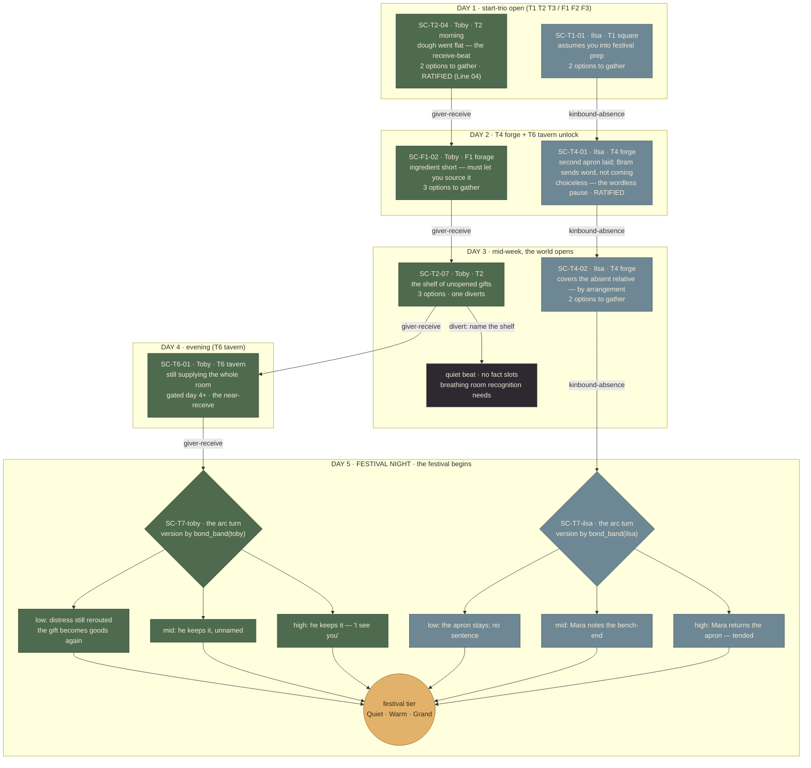
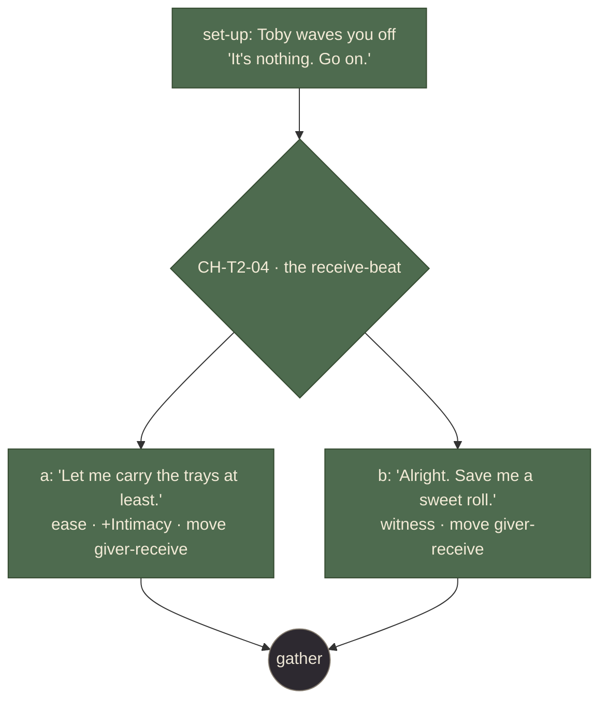
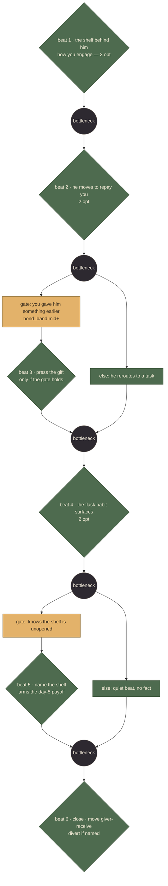

# Lantern v2: the UI overhaul, and a content slice to build it against

> **⚠ SUPERSEDED IN PART (ruling 2026-08-05): region geometry is a compact last-write-wins map in the run folder, not an append-only edit journal.**
> The L8 region-authoring section below (from "Add `POST /__bridge/region-edits`", ~line 1117) describes machinery that no longer exists.
> Authority: Paca **GP-108** and **GP-107**.
>
> What changed, and why:
> - **`out/region-edits.json`, `old_shape` conflict detection, and replay are gone.** The journal was never visible in the tool, and the one time it was replayed it rejected 24 of 33 rows and kept the roughest draw per region — the guard only ever destroyed correct work. Roc's ruling: keep an edit log only if it powers undo. It didn't, so it went.
> - **Geometry now lives per-project**, in `<run-dir>/regions.json` as `{ screens: { [screen_id]: { [region_id]: rect } } }`. Nothing writes to the global `data/screen-specs.json` any more — it declares *what* a screen has; the run folder decides *where*.
> - **`build --region-edits` and `apply-region-edits` are deleted.** `build` now overlays `regions.json` unconditionally, with no flag.
> - **Undo replaced the journal.** Every placement is a Command in the existing history, so Ctrl+Z works like any other mutation. Geometry stays in memory until an explicit "N placements pending → Apply".
>
> **What below still holds:** the reasoning at ~line 1131 — geometry must patch the *input* specs before `buildGraph`, never the built graph after it, because `buildGraph` re-reads the specs. That is exactly what the overlay does. Only the file format and the commands changed, not that constraint.
>
> The body is left untouched; the analysis remains useful history.

> **Design record.** Status is tracked in Paca (project `game-project`, prefix `GP`) — run `/pm`.
> This document holds the design rationale and the rulings behind it, not the current state of the work.

> **Phase labels are `L0`–`L8` throughout** (2026-07-30). Three documents each numbered their
> phases "Phase 1..N", so "Phase 4" meant this shell, the narrative content pass, *and* GDD
> assembly at the same time. The tracks are now prefixed: **`L0`–`L8` here (Lantern, the tool)**,
> **`P1`–`P5`** in `2026-07-28-branching-dialogue-spec-phase.md` (the narrative pipeline), and
> **Workstream 4–7** in `game-project-tasks.md` (historical task groups, not build phases).
>
> **Status — verified against disk, 2026-07-30.** An earlier banner here claimed "Phases 0–4 done
> and green." That was wrong, and a session trusting it would skip real work. Per-phase truth:
>
> | Phase | State | Detail |
> |---|---|---|
> | **L0** Assets + story | **DONE 2026-07-30** | `.avif` added to a single `IMAGE_TYPES` map shared by the read and write routes, so a format can never be uploadable but unservable · `POST /__bridge/image` with a separate `readRawBody` returning a Buffer · all 7 hardening checks (`validateImageName` + resolved-path containment + 20MB cap + overwrite refusal) · the real `AssetsPanel` replacing the stub, one row per screen with thumbnail, picker, drag-drop and an inline Replace on name clash · the 10 assets imported into `out-calib` · `StagePane`'s honest empty state |
> | **L1** Correctness | **DONE 2026-07-30** | All seven real bugs fixed, each with a regression test: **6** writes follow the loaded folder, not the text box · **3** `pending` deletes the record, and cards carry a Clear control · **2** Cancel writes nothing · **1** notes render on the card · **8** ids split on the last dot, matching the resolver · **7** repeated chips keyed by index (test added) · **4** broken images keyed by `screen_id`. **Bug 5 struck — not a bug**, see its entry. Also added `validateApproveBody`, which the route never had |
> | **L2** State seam + undo | **DONE 2026-07-30** | `src/state/commands.ts` + 15 tests: a `Command` with real forward inverses, a capped history, Ctrl+Z / Ctrl+Shift+Z, and undo/redo controls. **`LanternProvider` was deliberately NOT built** — its stated motivation (getting `api` off `node.data`) was already met by `SceneApiContext`/`LevelCtx` during L3, whose comment gives the same rationale verbatim. A third context would be a layer that earns nothing |
> | **L3** Layout engine | **DONE 2026-07-30** | The earlier 70% (split, `nodeHeight()` kill, TB default, rewritten `layout.test.ts`) plus the closing five: **`styleEpoch`** threaded `SettingsDrawer → App → SceneView`, now the third term in the relayout guard — this is the loop the old `nodeHeight()` comment admitted it could not close · a real **3-line CSS clamp** replacing the unbounded `pre-wrap`, with the full text kept on the title attribute · **minimap on `LevelView`** · **Reset layout** on both canvases · a floating **graph toolbar** |
> | **L4** + 4b Shell | **DONE** | See the ✅ note on the L4 section |
>
> **Test counts at the time L0–L4 landed: lantern 312 across 26 files, resolver 51** (was 219/51 when
> this plan landed). **These are HISTORICAL — the W-track added many more.** For the current bar, run
> the commands under "Running the track" and take what disk says; do not treat a number written in this
> document as the pass mark, or a reader comparing against 312/51 will conclude tests were deleted.
>
> **A use-driven round followed (2026-07-30), after Roc walked it in a browser:**
> - **The stage looked broken and was not.** `out-calib` had **no `day.json`** — `build` does not write one, `resolve-day` does. With no day data nobody stands on any screen AND every `npc_present()` gate fails, so scenes opened with no options. Both symptoms, one missing file. `computeHealth` now warns and names the command, because "no day.json" otherwise reads as a broken tool.
> - **Sign-off #6 RULED: opaque cards** (Roc). L6 is unblocked on that count.
> - **Sign-off #4 built:** node positions persist to localStorage, scoped per run + canvas + layout variant, with Reset layout clearing the scope.
> - **Speaker names are the authored names** — `graph.json` now exports the `souls` array, so cards and the transcript show "Toby", not "toby". Title-casing the id was the shortcut and would be wrong for any name that is not a plain capitalization.
> - **Assets gained a library:** uploaded-but-unassigned files are listed, one picture can serve several screens, and reuse writes the manifest directly instead of going through upload — which is what produced the "already exists, overwrite?" prompt when the honest answer was "yes, use that one here too".
> - **The struck bug 5's real defect is fixed:** the option's own review status and its line's edit are two marks now, so approving an option no longer hides that its line was edited.
> - **Two more scenes**, deliberately different shapes — see "What the tool build actually needs".
>
> **Next up: L5** (Blueprint cards + inspector), which needs the Roc-triggered Gauntlet Loop, and which Roc has ruled on: keep the existing variables panel and **add** the inspector as an eighth view (renaming the current `Inspector.tsx` to `VariablesPanel`), move approve/flag off the card so they cannot be hit by accident, and **give them a keyboard path** so a hidden inspector never makes approving unreachable.
>
> **L7 (live reload + notes) and L8 (markers + region authoring) are both UNBLOCKED** — sign-off #5 approved 2026-07-30. Only **L5 and L6** still wait, on the Roc-triggered Gauntlet Loop.
>
> **A week view is wanted** (Roc): the whole run's dialogue tree, scenes grouped by day and joined by thread — the arc-shape graph from Part 1. It needs no schema change: a scene's day is **derived** from its lowest `day >= N` condition, defaulting to day 1.
>
> The content slice (Part 1) has **6 of its 9 scenes** authored at structure level — see Part 1 for what the tool build actually needs, which is far less than the full arc.
>
> ---
>
> ## ⚠ Re-planned 2026-07-30 (second session): a `W`-track lands ahead of L5
>
> **Baseline at the START of this session: lantern 312 / 26 files, resolver 51, `tsc --noEmit` clean on
> both** — verified from scratch then, and now HISTORICAL: the W-track added a great many tests on both
> sides. Take the current bar from disk, not from this document. *(Note for anyone re-running: the
> resolver suite is `node --test`, so use `npm test` — `npx vitest run` collects 0 tests there and looks
> like a wall of failures.)*
>
> **Roc's goal, stated 2026-07-30:** *"complete L5–L8 so that Lantern is in a state where I can
> review scene shapes and a week run from a structural point of view and also play through a whole
> week without the game breaking. Currently variables do not get set, there is no override for
> variables, and no tests for if nodes are unreachable. The goal is to get the tool to final UI/UX
> state and create deterministic tests for playable state so that human review can be efficient."*
>
> Three of those items were **not in this plan at all**, and one of them is a prerequisite for L5.
> Diagnosis is in **W1** below. The short version: a whole-week playthrough is impossible today for
> four independent reasons, only one of which was known.
>
> **The order changes.** L5's inspector has no live values to show and the week view has no real day
> to derive until variables actually move, so playable-state correctness goes first:
>
> | | Work | Blocked on |
> |---|---|---|
> | **W1** | Playable week — bind the EXTERNALs, put a path from the day loop into dialogue | **Nothing — both decisions ruled 2026-07-30** |
> | **W2** | Reachability + deterministic walk tests | W1 |
> | **L5** | Blueprint cards + inspector, now including the **live variables panel with override** | W1 + the Gauntlet |
> | **W3** | Week view — a whole run reviewed structurally | W1 |
> | **L7** | Live reload + notes | — |
> | **L8** | Markers + region authoring | — |
> | **L6** | Depth restyle + the owed keyboard-only pass | The Gauntlet |
>
> **L6 moves last on purpose.** Restyling before L5/L7/L8's surfaces exist means restyling twice.
>
> **Gauntlet timing ruled (Roc, 2026-07-30): hold it until W1 and W2 land.** Its critics have to run
> the real app and time real review tasks. With variables dead and no week to walk, they would be
> judging a tool that cannot do its job, and any verdict on the inspector would be formed against
> empty panels.
>
> **Reader-test deferred — ruled (Roc, 2026-07-31): *"reader test is not meaningful until we can play a
> week through."*** The repo's standing rule is that a modified workflow doc passes `reader-test` before
> use. It is suspended for this plan until stage 1 below lands, because the gaps that matter here are
> the ones a played week exposes, and a prose review of a spec for unbuilt behavior would grade the
> writing rather than the design. Run it after stage 1, against what the week actually did.

## Context

Lantern v1 passed acceptance 8/8. Then Roc used it, and the real problems showed up. They fall into four kinds, and only one is cosmetic.

**1. It has nothing to show.** `tools/resolver/out-realdata/` holds `graph.json` and `ink/`. There is no `story.json` and no `manifest.json`, and all 21 regions across 16 screens have `shape: null`. Its one scene, `SC-T2-04`, is an empty stub: `lines: []` and `options: []`. So play mode never starts, the stage renders dead buttons, and no image can load.

**2. Real bugs.** Flagging appears to flag everything. Flag notes are invisible. Nothing can be unflagged.

**3. The shell can't carry the work.** Panes are locked and too small. There is no undo, no add-nodes, no health reading, and the cards are cluttered.

**4. It reads flat.** Roc wants Blueprint-style node cards and real depth, using the palette he already approved.

The v2 outcome: a desk tool Roc can review and playtest in, with real content and real art inside it. He can define assets, resize to see playtest beside the graph, undo a mistake, read his own flag notes, and leave a structural note that reaches Claude and repaints live once it lands.

## Roc's question, answered

He asked whether an in-place overhaul gets the editing flow, and said "if the look doesn't achieve the UX then that's not good enough."

A reskin does not get there. Three things cannot survive a repaint.

- The shell builds its layout by string-concatenating a CSS class over a hard-coded `1fr 320px` grid. There is no incremental path from that to tabs, a left rail, splitters, and an inspector.
- `NodeCard.tsx` *is* the action surface. Moving actions to an inspector leaves almost no shared markup.
- `sceneGraph.ts` guesses card pixel height from character counts to feed dagre. Restyle before that height is measured and graph spacing breaks silently, with no test to catch it.

**So: rebuild the shell, refactor the core, keep the libs.** The parts worth keeping are the expensive ones. `reviewApi.ts` is 15 lines and already the single mutation funnel, so undo attaches there without touching a canvas. The layout libs are pure and DOM-free. React Flow v12 is already installed, with `measured` node sizes available.

## What the asset folder changes

`C:\Users\rocle\Desktop\assets` holds 10 images. They are fewer than the 16 screens, but they cover **all six start screens**, which is exactly what the arc below needs.

| Asset | Screen | Note |
|---|---|---|
| `town-square.jpg` | T1 Town Square | |
| `town-market.jpg` | T2 Market Row | Toby's screen, and where Line 04 sits |
| `town-1.jpg` | T3 The Commons / Well | A cobbled street with tables, reads as a commons |
| `forest1.jpg` | F1 Forager's Clearing | |
| `forest2.jpg` | F2 The Stream | |
| `forest3.jpg` | F3 The Grove | |
| `lantern-festival.webp` | T7 Festival Grounds | Gated, outside the arc, useful later |
| `forest-cave-outside.jpg` | F7 The Cave, approach | Gated |
| `forest-cave-inside.jpg` | F7 The Cave, interior | Gated. Two images for one screen is not something the manifest can express today. |
| `town-2.avif` | T6 The Tavern / Inn | **Will not render.** See below. |

Two concrete findings from this folder:

- **`.avif` is missing from the bridge's extension map** at `vite.config.ts:133`, which lists only `.png`, `.jpg`, `.jpeg`, `.webp`, and `.gif`. An avif file gets served as `application/octet-stream`, the `` fails, and `brokenImages` flips with no message explaining why. Add `.avif` to the map and to the upload allow-list. This is the kind of silent failure that reads as "assets don't load."
- **The manifest holds one image per screen.** `forest-cave-inside` and `forest-cave-outside` are two views of F7, and there is nowhere to put the second one. Not a v2 blocker, because F7 is outside the arc, but it is a real limit worth knowing before more art arrives.

The mapping above is a proposal. Roc corrects it in the Assets panel, which is the point of building that panel.

---

# Part 1. The content slice

Roc asked to spec a story arc. Checking the docs corrected the framing: the arc already exists and is ratified. `narrative-pipeline/arc-festival-slice.md` ("The Festival Slice, lives 1–2") is the steering layer, and it names no screens at all. It deals in World Truths, soul spines, threads, and generative pools.

**The units, so the scope is unambiguous.** A day is one location and 3 to 5 screen-moves. A run is 5 days. The arc spans two lives, so roughly 15 to 25 screen-visits per life across the same 16 screens, with heavy repeats. The arc measures itself in **scenes**, not screens ("any thread untouched past the cap, default six scenes").

So the v2 build does not need a new arc. It needs the arc **populated**: the Festival Slice steered into actual scenes across the 5-day week, sitting under the ratified arc doc. What it buys: even with every bug fixed, a graph holding one empty scene gives the new UI nothing to judge, and the shell would take the blame for a content gap.

## The shape

**Scope: the full 5-day week, two souls.** Nine scenes carrying Toby's and Ilsa's arcs from day 1 to festival night, drawn in full below. Roc's direction: the arc spans the whole week, and the beats vary in shape rather than repeating one 2-option pattern. The week is anchored by the progressive unlock — day 1 is the start-trio, and screens open as the days advance until T7 Festival Grounds opens on night five.

**Why two souls and not more.** Toby and Ilsa are the only souls with approved persona cards. Mara has an essence entry in `gdd/07-cast.md` but no card, and writing her dialogue would mean inventing a third `primal_seed` and a third asymmetry axis, which reopens the Soul-3 watch item. She appears once, at Ilsa's festival payoff, using only her carded behavior (she returns the second apron), which the ratified echo already specifies.

**Why this stays clear of the open rulings.** The arc's payoff scenes touch T4, T6, and T7, which are gated screens. But the *gates themselves* are not what this content decides — the scenes assume the screen is reached and play there. **So the arc needs none of the six review-doc items still waiting on Roc** (B1, C1, C3, C4, D2 through D6, D11 through D15). Those decide how the locks work, not what Toby says once you are inside. The arc can be written while those rulings stay open.

**Line 04 is the spine — but it is not in the data.** Corrected 2026-07-30: `SC-T2-04` and `CH-T2-04` appear **nowhere** in `data/scene-graph.json`. An empty stub lives in `out-realdata/graph.json`, which is a gitignored build output generated from a source that no longer exists. The authored Line 04 prose lives in `tools/lantern/fixtures-review/graph.json` under the **wrong scene id** (`SC-T2-01`), using the retired string form of `state_actions`. `data/role-workplace.json:26` meanwhile asserts "the Giver-as-Baker scene (SC-T2-04) already sits on T2" about data that does not exist. Line 04 is still the ratified acceptance case for the whole choice-node schema, so **porting it into `data/scene-graph.json` is transcription, not authoring** — and it is the one piece of content the tool build genuinely needs (see "What the tool build actually needs").

## Placeholder structure first, real prose second

This is the pipeline's own order, not a shortcut. Step 6 of `pipeline.md` is "Graph before prose": code builds the node IDs, gating, and structure, and prose fills one slot per call afterward. The existing `SC-T2-01` fixture is exactly this shape, with real branching and grey lines like "Placeholder: Toby is behind on the feast trays."

So the arc lands in two passes:

1. **Structure pass.** All nine scenes with real topology, real gating, and placeholder line text. This is what the v2 UI is built and judged against, and what the week-arc graph below shows.
2. **Prose pass.** Real lines fill the slots, through the agent chain, gated by Roc. It can trail the whole UI build, because the UI is judged on structure.

**The rule that makes this safe: placeholder the text, never the structure.** The option count, the verb families, the `state_actions`, the availability gates, and both required notes must be real from pass 1, because the branching topology is the thing Roc reviews in the graph. A node with placeholder structure shows him nothing. A placeholder scene still passes every guardrail check. It just carries grey prose in the slots.

## What the structure pass produces

- **Nine scenes across five days**, two of them lifted verbatim from the ratified soul cards. The week graph below is the arc shape; each character scene expands into a branch-and-bottleneck conversation shape (see "Conversation shape").
- **Branch-and-bottleneck shapes with gated paths**, six-plus beats for the character scenes, answering the "too predictable" and "too short" notes. The two arc turns branch into low/mid/high variants by `bond_band`.
- **Toby on T2 in the morning**, matching `role-workplace.json`'s baker anchor and the existing `SC-T2-04` placement. Ilsa anchored to T4, the forge, matching the same proposal's blacksmith anchor. Both placements are proposals Roc gates.
- **Five thread IDs, minted from the existing arc.** Not new threads. `arch-promote-proposal.json` flags this gap directly: `arc-festival-slice.md` names its five "Threads to Not Drop" in prose without IDs, while `CH-T2-01` already references `giver-receive` as though one exists. The arc mints IDs for the five threads already written, and moves two of them across the week. It invents none.
- **A `KnownPhrases` entry or two.** Corrected 2026-07-30: there is **no `data/state.ink`** — the file is generated by `src/graph.ts:85`, deriving the list from `knowledge_flag` state_actions in the scene data. `out-calib/ink/state.ink` already declares five real phrases (`gave_gift, offered_help, saw_apron, shelf_named, shelf_seen`); only the stale `out-realdata` and `out-fixtures` builds still say `placeholder_phrase`. So this is not a file to hand-edit — new phrases arrive by authoring the state_actions that mint them.

## Proposed week arc (for Roc's review)

This is the story-architecture view: both souls' arcs across the full 5-day run, built to the festival. It names every scene, its day, its shape, and the thread it moves. It is the arc-level shape Roc approves first, before any conversation is shaped.

**The week's spine is the progressive unlock.** Day 1 is the start-trio only. Screens open as the days advance (`level-layout_draft.md`: "early days fewer reachable screens, later days more, the world opens up"), so the arc spans all five days by construction and lands on festival night.

> **T7 correction (Roc's D11 ruling, 2026-07-30).** The Festival Grounds **access lock was removed** — T7 is `status: start` and can be visited from day 1. Only the *festival* happens on the last day, which is a calendar event in the day/progression data, not a screen lock. So "T7 opens on night five" is no longer accurate, and the day-5 subgraph label below should read *the festival begins*, not *T7 opens*. The arc itself is unaffected: both payoff scenes still play on T7 on night five. Related: the asset table above calls `lantern-festival.webp` "gated, outside the arc" — it is neither. T7 is open, and it carries the arc's two climax scenes.

**Two mechanisms, not one.** Show/Ask and Converse are dialogue scenes — choice nodes with a soul, the branching the graph renders. Collect, Use, and Make are stage interactions — item slots, braziers, crafting hotspots from regions and `day.json` rolls, not choice nodes. The arc below is the dialogue track. The verb demos ride the same screens as stage geometry (L8's marker work).

**Two arcs, from the ratified soul cards.** Toby the Giver, dealt Baker: *can't receive → can*, freed by being claimed unearned. The feast can't be finished alone, so the role manufactures receive-beats. Thread: `giver-receive`. Ilsa the Kinbound, dealt Blacksmith: *given → tended*, never converted to chosen-family. Her pressure is Bram, the family member who does not come (a Roc-authored fact). Thread: `kinbound-absence`. Her turn fires on a bond level, the one sanctioned exception.

**Two zoom levels, both reviewed.** This graph is the **arc shape** — scenes across days, threads flowing to the festival. Each character scene then expands into a **conversation shape** — a branch-and-bottleneck of six-plus beats with gated paths, drawn in "Conversation shape" below. Roc approves both levels, per the workflow. The nodes here are scenes, not beats.

**The turns come in three versions.** Each arc turn selects a variant by `bond_band(soul)`, which is `low / mid / high` and compiles today. So how the week went changes how the turn lands. This is the game's own spectrum (the festival dresses Quiet, Warm, or Grand), applied to the two soul turns.



Green is Toby's track, blue is Ilsa's, each flowing down the five days along its thread to a festival-night payoff. The tier the festival reaches reflects the week's spend.

**The scene worklist** — what the dialogue-editing pass fills, in order:

| Scene | Day | Soul | Screen | Beat | Shape | Status |
|---|---|---|---|---|---|---|
| `SC-T1-01` | 1 | Ilsa | T1 | Assumes you into the festival prep | Short — establishing, ~3–4 beats | Proposal |
| `SC-T2-04` | 1 | Toby | T2 | The dough went flat; the receive-beat | The ratified beat, opening a longer scene | **Ratified prose, NOT in the data** — port it |
| `SC-F1-02` | 2 | Toby | F1 | Ingredient short; must let you source | Branch-and-bottleneck, ~6 beats | Proposal |
| `SC-T4-01` | 2 | Ilsa | T4 | Second apron laid; Bram not coming | Choiceless — the wordless pause | **Ratified** (forge scene) |
| `SC-T2-07` | 3 | Toby | T2 | The shelf of unopened gifts | Branch-and-bottleneck, 6 beats, 2 gated, 1 divert | **Shipped** (calibration slice) |
| `SC-T4-02` | 3 | Ilsa | T4 | Covers the absent relative | Branch-and-bottleneck, ~6 beats | Proposal |
| `SC-T6-01` | 4 | Toby | T6 | Still supplying the room; near-receive | Branch-and-bottleneck, gated `day>=4` | Proposal |
| `SC-T7-toby` | 5 | Toby | T7 | The arc turn | Deep — low/mid/high by `bond_band(toby)` | Proposal |
| `SC-T7-ilsa` | 5 | Ilsa | T7 | The arc turn | Deep — low/mid/high by `bond_band(ilsa)` | Proposal |

Two of the arc's five threads move. The other three (`keeper-corner`, `past-absence`, `arch-ages`) stay untouched, because they turn on Mara and the absent souls, outside a Toby-and-Ilsa arc. **Ratified** scenes are lifted from the approved soul cards. Proposals are placeholder-level and the thing to review. Every scene satisfies the structure rules; the prose is grey until the prose pass.

One scene drawn to the option level, so the dialogue-editing detail is visible — the ratified Line 04:



## Conversation shape (for Roc's review)

The ratified lines set the length of a scene *unit*, not a *conversation*. A single 2-option gather is too thin to learn a soul; Roc's read is that even a short conversation runs about six beats. The reference shapes (`C:\Users\rocle\Desktop\branching-dialogue\examples`, plus the Mirkowski article) all point at one form: **branch-and-bottleneck with gated paths**. Detroit's flowchart is the clearest — investigation paths fan out, some open only when a state condition is met (the yellow flag nodes), and everything funnels into a bottleneck before the next stretch.

**The schema already supports this whole shape.** No new mechanic is needed, only the right scale:

- **Beats** — chained choice nodes — are the spine. Six or more for a real conversation.
- **Bottleneck** — the `gather` — is where branches reconverge before the next beat. Cheap, and it keeps the walk linear in choice-count for QA.
- **Divert** — a branch that jumps to a different node or scene instead of rejoining — is the expensive fork that makes a replay differ.
- **Gated path** — a choice node's `availability_conditions` — opens a beat only when state is met: `bond_band(soul)`, `knows(phrase)`, `day>=N`, or a prior choice's `state_action`. This is the yellow-flag gating in the references, and every one of those predicates compiles today.

Toby's day-3 shelf scene, redrawn as a six-beat branch-and-bottleneck with two gated paths, so the real shape is concrete:



Six beats, two condition-gated paths (amber), bottlenecks between them, one divert at the close. The player who gave Toby something earlier gets a different middle than the player who did not, and a second life through the week can play it another way. That is what "branchy" and "enough time to learn the soul" look like together.

## The authoring workflow Lantern serves

Roc's described loop is the reason the tool exists, and it is shape-first:

1. **Approve the shape of the arc and its theme** — the week graph above, at the scene level.
2. **Approve the shape of a conversation** — a beat-and-bottleneck graph like the one above, with placeholder dialogue, before any prose.
3. **Say what each beat must do** to serve the arc, and adjust the nodes — a structural note on the graph, addressed to the pipeline.
4. **The pipeline fills the dialogue** into the approved shape.
5. **Roc edits** the filled lines in place.

Two things follow for the build, and both are already in the plan rather than new scope:

- **The graph view is the primary surface, and it must render gates.** A gated path shows its condition on the graph (the amber nodes above), so Roc can read where a branch opens without leaving the graph. This sharpens L3 (the layout engine) and L5 (the node cards) toward showing `availability_conditions`, not just topology.
- **Structural notes are how a shape gets approved and adjusted**, which is exactly L7's note channel (`kind: structure`). "This beat needs to do X" lands as a note on the node, and the graph repaints when the adjusted shape is built. In-tool node dragging and adding stays a v2 horizon; v1 is review the shape, note the change, rebuild.

So the content deliverable is not nine thin scenes. It is a set of **approved conversation shapes** — branch-and-bottleneck, six-plus beats, gated paths, placeholder dialogue — that the pipeline then fills. The week graph is the arc shape; each scene expands into a conversation shape like the shelf scene above. Roc approves both levels before prose.

## Hard constraints the shape work must respect

These come from the existing contracts, and breaking any one of them means `build` fails or a guardrail check flags the content.

- **Only 9 of the 11 predicates compile.** `predicates.ts` has no branch for `threads_moved` or `role_goals_advanced`, and `compilePredicate` throws on anything it does not recognize. Keep both out of every `availability_conditions` array.
- **Two or three options per choice node. Never one, never four.** A node needing four surfaces to Roc as a decision rather than getting widened.
- **Both notes are required on every choice node.** `equal_weight_note` states what each option costs and what it respects. `no_accrual_note` states that no counter keys off repeated picks. Check 10 flags a node missing either.
- **Exactly one of `player_line` or `surface_action` per option.** `player_line` is a content_id pointing at a real line slot. `surface_action` is a literal inline string rendered in brackets, and never becomes a `ContentLine`.
- **Word ceilings are absolute**: 40 for dialogue, 60 for action and object, 12 for a `player_line`. They live in the register contract, not in `tuning.json`. These bind the prose pass, not the placeholder pass.
- **The player voice**, from `narrative-pipeline/register.md`: one clause, plain, deflect rather than name. Exact about what-is, vague about what-it-means. A `player_line` never explains its own feeling. `[Comfort him]` is a defect; `"Let me carry the trays at least."` is the form.
- **Follow the fixture, not the stub.** `tools/resolver/fixtures/scene-graph.json` scene `SC-T2-01` is the only schema-complete scene in the repo and what all 47 resolver tests run against. Naming reads straight off it: lines are `L-<scene_id>-NN`, a player line is `L-<option_id>-p`, a response is `L-<option_id>-rN`.

## Where the arc spec lands

Write it to `ProjectOS/game-project/resources/festival-week-arc_draft.md`, following the `spec` command, then transcribe the approved structure into `tools/resolver/data/scene-graph.json`. Roc gates the spec before any transcription, per the standing review-before-build gate. The week-arc graph above is the review artifact that gate runs against.

**Sequencing note.** The arc spec is prose plus JSON, and it does not depend on any Lantern code, so it *could* land beside L1's bug fixes. **Ruled 2026-07-30 (Roc): it doesn't.** The tool exists to make content, so the tool gets finished first and the arc waits — see "What the tool build actually needs" below. The prose pass can trail the whole UI build regardless, because the UI is judged against structure, not final words.

## What the tool build actually needs (ruled 2026-07-30)

Roc's question — *"how much do we actually need to finish the tool build? the tool is supposed to help making content"* — and the answer is **one scene and ten images**, not the nine-scene arc.

The three calibration scenes already exercise everything the UI is judged on: choice nodes, options, gates, gathers, `state_actions`, and both option shapes. What the remaining phases need is **assets, not narrative** — L0 wants the ten images, and L8 *builds* region geometry rather than consuming it.

The one genuine requirement was **Line 04**, because the S5 acceptance script — re-run at every gate — reads *"review Line 04's choice node; edit one player_line; the edit survives regeneration; play both branches."*

**Ported 2026-07-30. `SC-T2-04` is now in `data/scene-graph.json`, compiles, and plays both branches.** The prose is verbatim from the approved fixture; only ids and action shapes were migrated to the current schema (`L-<...>` naming per the fixture rule, object-form `state_actions`). One contract worth knowing for the next port: **a line is emitted as free-standing narration unless it back-references its `choice_id` AND `option_id`** (`src/ink.ts`). Without those, a player_line and its responses play as narration *before* the choice and again inside it. Walked to confirm: branch a gives *"...Fine. The small ones. Mind the edges."*, branch b gives *"Ha, go on then. I'll save you a sweet roll."*, and with Toby absent the `npc_present(toby)` guard offers 0 options while the scene still reaches its gather — the standing gate rule holding.

Deferred until the tool is done, and correctly so: the remaining six scenes, the arc spec (`resources/festival-week-arc_draft.md`, never written), the three unminted thread IDs (`keeper-corner`, `past-absence`, `arch-ages` — only `giver-receive` and `kinbound-absence` exist), and the bond-band force-state control, which is only needed once an arc turn exists.

**Shape variety — done 2026-07-30.** The standing rule says scene shapes must vary; the three calibration scenes were near-identical six-beat/one-gate by design. Two more were authored so the tool is judged against a range:

| Scene | Shape |
|---|---|
| `SC-T2-04` | the ratified unit — 1 beat, 2 options |
| `SC-T1-01` | short establishing — 3 beats, 2 options, no gates |
| `SC-T2-07` · `SC-T4-01` · `SC-F1-02` | the standard — 6 beats, one gate |
| `SC-T6-01` | deep — 8 beats, a `day >= 4` gate, a `knows()` gate, one 3-option beat, one divert |

Structure is real, prose is placeholder — real lines go through the crew, gated by Roc. All six compile and walk to an end.

**On a scene's day, and whether a beat can be missed (Roc asked).** A scene is never pinned to a day. `day >= N` is already one of the nine compiling predicates and the compiler handles `>=`, `<=`, `==`, `>`, `<`, so:

- *"starts day 1, still catchable later"* — no day condition at all. Availability is a **floor**, so catch-up is the default.
- *"not before day 4"* — `day >= 4`, as `SC-T6-01` does.
- *"only during days 2–3"* — `day >= 2` and `day <= 3` together.

An arc view therefore **derives** a scene's day from its lowest `day >= N`, defaulting to 1. No new field, nothing new to compile. Proven against `SC-T6-01`: on day 3 the first beat offers nothing and falls through to beat 2; on day 4 it offers all three.

---

# Part 2. The build

## First milestone: the calibration slice — DONE

Shipped and walked by Roc. Length and shape validated ("good start in terms of length"). What landed:

1. **Three authored scenes** in `tools/resolver/data/scene-graph.json`, each a six-beat branch-and-bottleneck with a walkable `knows()` gate: `SC-T2-07` (Toby, the shelf), `SC-T4-01` (Ilsa, the forge — the six ratified forge lines kept verbatim as set-ups, player options threaded between), `SC-F1-02` (Toby, forest sourcing). Two souls, three screens, town + forest.
2. **`resolver build --emit-story`** — `resolver/src/story.ts` (promoted from the test helper) compiles the emitted ink and writes `out/story.json`; doubles as the compile check.
3. **The layout engine** — `lib/sceneGraph.ts` split into `buildSceneModel` (pure topology) + `layoutSceneGraph(sizes, direction)`; `nodeHeight()` killed via measured relayout (`useNodesInitialized`); **TB default + ↓/→ toggle**; nodes draggable; minimap; api via context so drags survive play-step re-renders.
4. **Gate legibility** — gated beats get an amber dashed ring, amber `gate:` chips, and an amber dashed **"gate fails" bypass edge** to the gather.
5. **Gate-fallback correctness fix** (Roc's catch: a gate must not block a scene from ending) — every gated beat emits a fallback `* -> gather`, so a failed gate auto-skips instead of dead-ending. See the standing rule below.
6. **Dialogue full-view toggle** in the header (relieves the cramped quarter-pane, pending the shell).

State: resolver 50 tests, lantern 103 tests, tsc clean.

## Standing rules earned during the calibration

- **A gate narrows what's offered, never whether the scene completes.** Every gated choice node emits a fallback divert to its gather (`ink.ts`), proven by `resolver/test/gate-fallback.test.ts`. Author gates freely; the scene always ends.
- **Scene shapes must vary** (Roc, noted while walking the three). The three calibration scenes are near-identical six-beat/one-gate shapes on purpose (to validate the pattern); real authoring must range across the Unit / Standard / Deep vocabulary and vary beat count, branch count, gate placement, and the divert. Do not stamp the same mold every time.
- **Bond-gated variants need a force-state affordance.** The arc turns select low/mid/high by `bond_band`, which cannot flip in canned play (the bond EXTERNAL is a no-op). Walking each variant needs a tool control to set the bond band. Deferred, flagged for Roc.

## Full phase sequence

## Sign-offs needed before building

Each one reverses or extends a dated ruling.

| # | Change | Why |
|---|---|---|
| 1 | Lantern writes outside `out/`, into `<run>/images/` and `<run>/manifest.json` | L0 needs it. The spec says the only outputs are its own two record files. The geometry-free manifest rule still holds, because the route only ever sets `manifest[screen_id] = "images/<name>"`. |
| 2 | The graph flows top-to-bottom by default | Reverses Roc's 2026-07-29 left-to-right ruling. A direction toggle keeps the old reason available (options stack like the in-game choice list) instead of discarding it. |
| 3 | An 8px splitter gutter, below the 44px target floor | A 44px gutter on a mouse-driven desk tool is absurd. The effective target is 8px by the full pane height, and it works from the keyboard. A knowing deviation, not an oversight. |
| 4 | **BUILT 2026-07-30.** Node positions persist to localStorage, not the run folder | View state should not live in a file the resolver regenerates and git tracks. `lib/positions.ts` scopes each saved arrangement by run + canvas + layout variant, so a position computed for a constellation never lands in a tree; "Reset layout" clears the scope. |
| 5 | **RULED: approved (Roc, 2026-07-30).** Region geometry only for regions the spec already declares | Keeps "v1 edits words, not structure" honest. L8 may fill in the 21 `shape: null` regions; it may NOT mint a region for something unspecced. Marking a new thing writes a note to the pipeline, because a new examinable is not just geometry — it needs a clue tier, maybe a gate, and it changes what the screen means. **L8 is unblocked.** |
| 6 | **RULED: opaque (Roc, 2026-07-30).** Cards stay opaque. Depth comes from layered shadow, border, gradient, and a top-edge highlight | `test/contrast.test.ts` parses opaque hex out of `tokens.css`. Translucent cards over the night canvas make the real background a blend, so **the test stays green while real contrast drops below 4.5:1**. Highest risk in the visual work, and invisible unless named. |
| 7 | `resources/review-tool-spec_draft.md` gets amended, not ignored | Several v1 non-goals move into v1. The spec's visual-states table was already superseded by the shipped skin and never updated. |

## Phases

Each phase lands reviewable on its own and ends green.

### L0. Assets become definable, and the story becomes playable

Roc corrected the premise here. Don't generate placeholders. Build the surface he defines assets in, and point it at his real folder.

- Promote `resolver/test/helpers/compile.ts` to `resolver/src/story.ts`. Add `resolver build --emit-story`, writing `out/story.json` from `story.ToJson()`. About 20 lines for the thing blocking all of play mode.
- Add `.avif` to the extension map at `vite.config.ts:133`.
- Add `POST /__bridge/image?dir=&screen_id=&name=`, taking raw bytes rather than multipart, since the client already holds a `File`.
- **Write a separate `readRawBody` returning a `Buffer`.** The existing `readBody` accumulates into a string and will mangle image bytes through UTF-8 decoding.
- Harden that route past the read-path guard at `vite.config.ts:127`, because this one writes. Check the content type against an allow-list. Run `path.basename`, then reject if the name changed, so a traversal attempt is an error and not a silent fix. Whitelist the character set. Require the extension to match the content type. Re-verify the resolved path stays under `<dir>/images/`. Cap the body at 20MB. Refuse to overwrite without `?overwrite=1`.
- Add an asset panel: one row per screen, showing a thumbnail or "no image", with a file picker and drag-drop to assign. Write the manifest on drop. The panel is deliberately minimal and lands as the **Assets view** — post-L4b that view already exists as a labelled stub at `App.tsx:485`, so this replaces the stub rather than adding a tab. The route and its validation carry over untouched, and that is where the real work is.
- Import the 10 assets against the mapping table above, so Roc opens the panel to a populated state and corrects it rather than starting from nothing.
- Give `StagePane`'s dead-button branch an honest empty state: "no story.json in this run folder. The graph is reviewable, play needs a compiled story."

*Gate: Roc walks the world in play mode over his own art.*

### L1. Correctness pass, with no UI change

All eight bugs, each with a test. The order matters, because they depend on each other.

**Bug 6 first.** Writes target `dirInput`, the live text box, instead of `run.dir`. Type a folder without pressing Load and every write goes somewhere else. `RunPayload.dir` already exists and is unused. This changes where everything writes, so it goes first.

**Bug 3 next.** There is no `pending` write path, so a flagged card can never return to unreviewed. Fix it by deleting the key, because `store.ts:5` already reads absence as pending, and writing `{status:"pending"}` would be a second way to say one thing. Undo depends on this fix.

Then the rest:

- **Bug 2.** `window.prompt(...) ?? undefined` flags even when Roc cancels. Likely root of "flagging one flags all of them."
- **Bug 1.** Nothing renders `approvals[id].note`. Fix it on the existing card so Roc can read his old flags right away.
- **Bug 8.** `saveEdit` splits the approval id on the first dot. The resolver splits on the last.
- ~~**Bug 5.** `SceneView.tsx:103` leaks a player_line's `edited` status onto its option.~~ **STRUCK 2026-07-30 — not a bug.** For a spoken option the card *displays the player_line's text* (`text={api.textOf(target, original)}`), and the player_line's own content_id has no card anywhere. Remove the surfacing and editing a player_line changes the text with no status change — the edit goes invisible. Two green tests pin both directions (`SceneView.test.tsx:113` and `:122`). **The real defect underneath is the opposite one:** a single badge carries two different facts, so approving the option and then editing its line lets `ownStatus` win and hides the edit. Fixing that is a *display* change — a distinct "line edited" marker beside the option's own status — and it belongs in L5 with the inspector, not here.
- **Bug 7.** Chips are keyed by their text, so duplicate state_actions produce duplicate React keys.
- **Bug 4.** `brokenImages` is a Set keyed by image path, so several screens sharing one placeholder all break together. Same shared-key shape as the flag complaint.

*Gate: the existing flagged mess is finally readable and unflaggable. This fixes Roc's reported pain before any pixel moves.*

### L2. State seam and undo/redo, with no visual change

Two new files. **No reducer and no store library.** Every write already returns the complete new `approvals` or `edits`, and the handler replaces that field wholesale. A reducer would be three actions each doing `{...run, field}`, which buys nothing.

**`state/commands.ts`.** One interface: `Command { label; do(); undo() }`. Undo cannot be `past.pop()` on client state, because these mutations are HTTP writes to append-only files. Each command carries a real forward inverse instead. `approve` inverts to `setStatus(id, previous)`. `saveEdit(t, old, new)` inverts to `saveEdit(t, new, old)`, which works for free because `store.ts` and `resolver/src/edits.ts` both replay in timestamp order with later-wins. No tombstones, and no change to the file format. History is a `useRef` capped near 50, because commands hold async closures. Those are not serializable and would double-invoke under StrictMode.

**`state/LanternProvider.tsx`.** One context. The reason is not prop-drilling. React Flow custom nodes receive data only through `node.data`, so `api` currently gets stuffed into every node object, and the node array is memoized on `props.api`. Every change to `api` identity rebuilds every node, which would destroy dragged positions and re-trigger measured relayout. Moving `api` to a hook is what makes drag and measurement stable.

Out of scope by decision: Redux, Zustand, immer, a router, and optimistic UI. Navigation stays separate from mutation history, and that separation is why undo stays near 40 lines.

*Gate: Ctrl+Z works on approve, flag, and edit, and the files on disk agree.*

### L3. Layout engine, still on the old cards

A hard prerequisite for the restyle, not a preference.

- Split `lib/sceneGraph.ts` into `buildSceneModel(scene)`, pure topology with no geometry, and `layoutSceneGraph(model, sizes, {direction})`, where sizes are an input.
- Kill `nodeHeight()`. The first render uses one coarse constant per kind so React Flow can measure. `useNodesInitialized()` then reads `node.measured`, relayouts, and calls `fitView`. Guard it with a ref keyed on `sceneId + direction + styleEpoch` so it runs once.
- Clamp body text in CSS, not JS. Unbounded text makes measured heights vary wildly and the graph unreadable.
- Have the settings drawer bump `styleEpoch`. That closes the loop `nodeHeight()`'s own comment admits it cannot: change `--text-body` and the graph relayouts correctly instead of overlapping.
- Add top-to-bottom as the default, with a direction toggle. Turn on `nodesDraggable`. Add a minimap, a Reset layout button, and a graph toolbar.
- Rewrite `test/layout.test.ts`. It currently pins left-to-right and asserts `top.height >= 118`, which checks the guess against itself. The new tests feed synthetic size maps and assert ordering, sibling stacking, and no overlap.

*Gate: Roc flips top-to-bottom against left-to-right and decides. That honors both his old ruling and his new one.*

### L4. Shell + navigation layer — ✅ DONE (shipped 2026-07-30, incl. an L4b rework)

> **Shipped differently from the spec below — read this before L5.** The original rail-led
> shell landed first (left rail with scene counts + health, level-map badge, one `.shell` grid,
> `Splitter` with pointer-capture drag). Then Roc used it and called an **L4b** rework, which
> is what is now on disk. The **global Graph/Playtest/Assets tab model was replaced** by a
> **per-pane view-host model**: a fixed left navigator (`SceneRail` + `HealthReadout`), plus a
> **centre and right view-host that each independently pick any of 7 views** (Dialogue, Level,
> Stage, Play, Sweep, Variables, Assets); the right pane is hideable; `mode` is derived from
> whether a play surface is visible, not from a tab. Extras beyond the first spec: three
> per-pane **level-layout modes** (Constellation / Tree / List), per-pane scene-list folding,
> **recent-folders history + auto-load last folder**, and **dynamic splitter max** (no hard wall).
> New files: `components/ViewHost.tsx`, `lib/views.ts`, `lib/prefs.ts`, `lib/folders.ts`.
> Removed: the global `TabBar`, the `--rail-h` nav splitter, and the "Mock play states" toggle.
> **Net for later phases: there is no fixed `col-side` anymore — the right column is a view host.**

This is the active chunk. Roc's pains: stuck in one cramped view, and can't see which screens have dialogue. Roc's rulings this round: **full shell — tabs as the frame with resizable panes within each tab** (Vita Mors does exactly this); **scene presence is rail-led** (a left rail lists screens with scene counts — 0 reads as empty at a glance — grounded in the reference, whose navigator is a grouped-count rail, not map badges), with a **secondary count badge on the level map** for spatial context. State stays lifted in `App` + the `LevelCtx` / `SceneApiContext` already added. **No undo, no correctness bugs, no live-reload, no depth restyle in this chunk** — those are later phases.

**The shell layout — one grid, three columns, resizable within a tab.**

```
┌────────────────────────────────────────────────────────────────────────┐
│ header: Lantern · run folder · Load · ▶Play/■Exit · Focus dialogue · ⚙  │
├──────────────────────────────────────────────────────────────────────── │
│ tab bar:  [ Graph ]  [ Playtest ]  [ Assets ]                            │
├──────────────┬───┬──────────────────────────┬───┬───────────────────────┤
│  col-nav     │ A │   col-dialogue (1fr)     │ B │  col-side             │
│  --rail-w    │   │   scene-list strip        │   │  review: Sweep +      │
│  ┌─────────┐ │   │   ───────────────         │   │          Inspector    │
│  │SceneRail│ │   │   SceneTree (dialogue)    │   │  play:  Stage + Play  │
│  ├── C ────┤ │   │                           │   │                       │
│  │LevelView│ │   │                           │   │  (+ HEALTH readout    │
│  │ + HEALTH│ │   │                           │   │   in the rail)        │
│  └─────────┘ │   │                           │   │                       │
└──────────────┴───┴──────────────────────────┴───┴───────────────────────┘
  A,B vertical splitters (column widths)   C horizontal (rail / map)
```

- **Tabs are the frame; panes resize within.** `Graph` and `Playtest` are built now (they reassign existing panes — Playtest just puts Stage+Play in col-side, so "content assignment, not a mode"). `Assets` is a stub tab until its real panel lands (deferred to L0). Tabs organize; the within-tab splitters mean a tab is never single-view.
- **`.shell` grid**: `grid-template-columns: var(--rail-w,340px) 8px 1fr 8px var(--side-w,340px)`. The two 8px tracks are permanent gutters — hover changes colour, never layout. col-dialogue is elastic (`1fr`), so the dialogue graph — the star — gets the surface.
- **col-nav** nests `grid-template-rows: var(--rail-h,200px) 8px 1fr`: `SceneRail` on top, splitter **C**, `LevelView` below. Navigation lives together on the left.
- **Old knobs fold away**: delete `mainClass`, `playLayout` and its button, the `.with-play`/`.graph-full`/`.scene-full` CSS and the separate `<main>` branch. `sceneFull` becomes flank-collapse (stash then zero `--rail-w`/`--side-w` on a shell ref, restore on toggle — read live vars off the ref because splitter drags write them inline and inline beats a class). `mode` stays, but only gates player machinery + selects col-side content.

**`components/Splitter.tsx` (~90 lines, no library).** One instance owns one CSS custom property on its grid parent. Props: `orientation`, `cssVar`, `storageKey`, `min`, `max`, `invert?` (sized track on the far side of the gutter — `--side-w`), `label`, `targetRef`. Drag = **pointer capture** (`setPointerCapture`), not window listeners — capture routes move/up even over the React Flow canvases. `pointermove` writes `target.style.setProperty(cssVar, next+"px")` + `aria-valuenow` **directly; React state is never touched mid-drag**, so the canvases don't re-render per pointer move (the whole point). `pointerup` releases capture and persists. Seed the vars once in a `useLayoutEffect` before paint (never bind the var in JSX `style=` — a re-render would clobber a drag). Keyboard: arrows ±2%, Shift ±10%, Home/End, Enter collapse/restore. A11y: `role="separator"`, `aria-orientation`, `aria-valuenow/min/max`, `aria-label`, `aria-controls`, `tabIndex=0`. Do **not** wire any `onResize → fitView` — it would yank the pan; both canvases already gate their `fitView` so a resize won't refire it.

**`lib/panes.ts` (~40 lines).** `readPaneSizes()` / `writePaneSize()` / `clamp()`, versioned localStorage blob `"lantern-panes-v1"`, defaults on empty/garbage — mirror `SettingsDrawer`'s try/catch reader. Pure, unit-tested.

**Scene presence — one pure seam feeds both rail and badge.** `lib/sceneIndex.ts` (~30 lines): `sceneIndex(graph)` groups `graph.scenes` by `screen_id`; `sceneCountOf(index, id)`; `screensWithScenes(graph)` returns only screens with ≥1 scene in `graph.screens` order. Pure, unit-tested — the single source of truth.
- **Rail** (`components/SceneRail.tsx`, ~70): top of col-nav. Screen header rows + their scene rows; active screen/scene highlighted. **Reuse the `.sweep-item` compact-nav grammar** (what `SweepPanel` uses), *not* the 260px `NodeCard` — wrong ergonomics for a narrow rail. A scene row can show `api.statusOf(scene_id)` as a trailing status word (a seam for later flag/notes roll-up). Rail screen row → `openScreen`; scene row → new `openScene(screenId, sceneId)` in App (a 2-arg wrapper over the `setScreenId; setSceneId` that `jumpToArtifact` already does).
- **Map badge**: add `sceneCountOf` to `LevelCtx`; `ScreenCard` renders a blossom-tinted count chip in `NodeCard`'s existing `badges` slot next to the lock badge (both in a fragment). 0-scene screens render nothing. **Reuses the `badges` slot — no new node component.**
- Presence rides its own props/context, **not** through `ReviewApi` — the mutation funnel stays untouched.

**HEALTH** in the rail (per the reference): pure `lib/health.ts` — reachability flood over `connects_to`, unreachable set, errors (dangling diverts, missing region refs, orphaned edits), warnings (null region shapes, missing images, pending-review count). Rendered as a small readout under the rail. Pure, unit-tested.

**Files.** New: `lib/sceneIndex.ts`, `lib/panes.ts`, `lib/health.ts`, `components/Splitter.tsx`, `components/SceneRail.tsx`, `components/TabBar.tsx`. Rewritten: `App.tsx` (one `.shell` grid + tabs + three `Splitter`s; delete `mainClass`/`playLayout`; `sceneFull` → flank-collapse; add `openScene`, the `sceneIndex` memo + `sceneCountOf` into `LevelCtx`, the `useLayoutEffect` var-seed). Touched: `LevelView.tsx` (+badge, +`sceneCountOf` in `LevelCtx`), `app.css` (replace `.app-main*`/`.canvas-col`/`.play-col`/`.side-col`/`.with-play`/`.graph-full`/`.scene-full` with `.shell`/`.col-*`/`.splitter`/`.tab-bar`/`.scene-count`/`.scene-rail`/`.health`). Unchanged: `SceneView`, `SceneTree`, `NodeCard`, `SweepPanel`, `Inspector`, `StagePane`, `PlayPane`, `reviewApi.ts`.

**Build order — green at every step.** (0) pure seams `sceneIndex` + `panes` + `health` + their unit tests. (1) `Splitter` in isolation + render/keyboard test. (2) one splitter behind today's layout (turn `1fr 320px` into `1fr 8px var(--side-w) `) to prove capture/drag/persist in the real app. (3) shell restructure: the `.shell` grid + tab bar + three splitters, delete the old grid, `sceneFull` → flank-collapse, update `App.test`. (4) scene presence: wire `sceneIndex` → rail + badge, add `openScene`. (5) HEALTH readout + polish. Each step ends `tsc` clean + vitest green.

**Tests (seam-first).** New pure: `sceneIndex.test.ts`, `panes.test.ts` (clamp bounds, default-on-garbage, step math), `health.test.ts`. Light component: `Splitter.test.tsx` (aria + ArrowRight updates `aria-valuenow` + the var; Enter collapse/restore — **pointer drag deliberately untested**, jsdom rects are 0), `SceneRail.test.tsx` (one row per screen-with-scenes + per scene; click calls `openScene`; 0-scene screens absent). Extend `App.test.tsx` for the restructure (tabs render, badge on a screen with scenes, rail lists `SC-T2-*`, clicking a rail scene opens the tree). Untested by design: splitter pointer drag, measured relayout timing, React Flow viewport resize.

**Seams left for later phases** (do not build now): col-side is content-assigned, so a tabbed context panel (Assets / notes) drops in without touching the grid; SceneRail rows carry a status slot for flag/notes roll-up; `Splitter.onCommit` reserved for saved layout presets; the elastic-centre + var-flank model leaves room for markers / image-upload as new col-side content.

*Gate: Roc resizes freely, sees graph + dialogue + play at once, and reads which screens have dialogue from the rail at a glance.*

## The words, so they mean one thing

Settled here because these sections drift between them, and the code is the arbiter:

- **beat = choice node.** One authored beat compiles to one `choice_id`
  (`scripts/author-scenes.mjs`: `CH-<scene tail>-<beat>`). "Beat" is the authoring word, "choice node"
  the schema word; they are the same object.
- **option** = one branch of a beat, one `option_id`.
- **gather** = the bottleneck a beat's options reconverge at, `g_`-prefixed.
- **scene** = a set of beats with one soul on one screen, one `scene_id`.
- **node** is ambiguous and best avoided. Where it appears it means a choice node, EXCEPT in L5/L6
  where it means a React Flow card, and in W2's "a knot no walk reaches" where it means an ink knot.

## Running the track: W1 → L6

Ruled 2026-07-31, in answer to Roc's *"how do we run W1–7 all the way through?"* Seven phases, four
stages, **two Roc gates**.

**W2's walker is what makes the rest safe to run, which is why it is not last.** The precedent is in
this plan's own history: a session reported "Phases 0–4 done and green" when `git log --all` proved L2
had never been written on any branch, and the 4b shell was built on top of an unfixed write path. A
prose status line cannot catch that. A walker that fails a build can. So the harness comes first and
everything after it runs behind it.

| Stage | Contains | Verified by | Needs Roc |
|---|---|---|---|
| **1** | W1 + W2 + L5's variables override | the walker, then Roc plays a week | plays a week |
| **2** | W3 → L7 → L8, **sequential** | walker stays green through each | — |
| **3** | L5 cards + inspector | Gauntlet critics + walker | triggers the Gauntlet |
| **4** | L6 restyle + the owed keyboard-only pass | wcag + `contrast.test.ts` + walker | triggers the Gauntlet |

**Stage 1 ends with Roc playing a week, and that is the deliverable rather than a check.** The walker
proves every node is reachable; it cannot say whether five days *read* as a week. Those are different
questions and only one of them is automatable.

Three rulings that set the shape:

- **Stage 2 runs sequential, not parallel (Roc, 2026-07-31).** L7 and L8 both add bridge routes and new
  views, so they collide in `vite.config.ts` and `lib/views.ts` — the two files hardest to verify by
  eye. Wall-clock saved by parallelism is spent again on merge resolution in exactly the wrong place.
- **L5's variables override is pulled forward into stage 1 (Roc, 2026-07-31).** W1 is what gives it live
  values to display, and it is the only way to review Ilsa's mid/high arc-turn variants while her scenes
  still carry no `bond_event`s. The blueprint-card half stays in stage 3 behind the Gauntlet.
- **Reader-test runs after stage 1** (see the banner), against what the week actually did.

**The verification rule, earned the hard way: a phase is done when disk says so.** Never a
self-report. The exact commands, because "run the build" was not actionable:

```
cd tools/resolver
npm test                    # node --test, NOT vitest. Includes the walker (test/walk.test.ts).
npx tsc --noEmit
node src/cli.ts build --data data --out out-calib --emit-story
node src/cli.ts resolve-week --data data --out out-calib

cd ../lantern
npx vitest run
npx tsc --noEmit
npm run build               # production build must succeed
```

Two traps in that list:

- **`npm run build` in the resolver is NOT the command above.** It runs `node src/cli.ts build` with
  no `--out`, which writes to `<package>/out` — not `out-calib`. Use the explicit form.
- **`build` does not THROW on a bad gate; it sets a non-zero exit code** (`conditions.ts` findings are
  printed to stderr). Check the exit code, not just the absence of a stack trace.

The walker has no command of its own — it runs inside the resolver's `npm test`. "Keep the walker
green" means keep that suite green.

Two environment facts that bite during long runs. A stray `python` process has repeatedly held ~10.5 GB
of commit and starved vitest with `Zone Allocation failed` — address space, not RAM, which is why
`vite.config.ts` caps `maxWorkers: 4`; `--max-old-space-size` makes it worse. And **files written by
script rather than the editor bypass the auto-commit hook** and need `git add` by hand.

### W1. Playable week — variables that move, and a world you can walk

Added 2026-07-30 from Roc's *"variables do not get set"* and *"play through a whole week without the
game breaking."* Both are real. Four independent faults break a whole-week playthrough, and only the
first was previously known. All four verified against `out-calib` and the generated ink.

**Fault 1 — bond, thread and canon events are announced and discarded.** `actions.ts:33` emits
`~ recordBond("toby", "Intimacy")` as an EXTERNAL. `system/externals.ink` declares it with a
`~ return 0` no-op, and `play.ts:89` sets `allowExternalFunctionFallbacks = true`. The call fires
into nothing. `bond_band(soul)` reads `bondLevel_<soul>`, which stays `0` for the whole session, so
**every mid and high arc-turn variant is unreachable by construction** — and `SC-T7-toby` /
`SC-T7-ilsa` are built entirely out of those variants. `recordThreadMove` and `recordCanonWrite`
have the same shape.

**Knowledge flags are the one thing that already works.** `~ KnownPhrases += saw_apron` is emitted
*alongside* the EXTERNAL, so `knows()` gates open correctly. Do not "fix" this, and do not have the
host also write the LIST — that would give one fact two writers.

**Fault 2 — a screen knot has no path into its own scenes.** `emitScreen` writes the intro line and
then `-> DONE`. Arriving at T2 prints `Placeholder: Market Row.` and the flow ends. Every scene is
reachable *only* through the tool's own `jumpTo` / `ChoosePathString`. **There is no organic route
from the day loop into any dialogue at all**, which is why "play a week" has never been possible.

**Fault 3 — the day loop reaches exactly one screen.** `emitMain`'s `screen_hub` offers
`Spend a move`, `End the day`, and `+ [Visit <first screen>]` — literally `graph.screens[0]`, so T1
and nothing else. `day` only advances in `day_end`, which the tool never drives, and
`advanceTime()` says so itself: *"stub: presence re-applied; ink TimeOfDay unchanged."* So a
`day >= 4` gate cannot open in play, and `SC-T6-01`'s gated half is unwalkable.

> **✅ W1 SHIPPED 2026-07-31.** All four faults closed, each pinned by a test.
> Two more were found while building and are closed too:
>
> - **`connects_to` was directed in the emitter and undirected in `computeHealth`.** T6, T7,
>   T8, F6, F7 and F8 each declare an exit and nothing declares one back, so the player could
>   leave them but never arrive. That stranded `SC-T6-01` and BOTH festival-night arc turns.
>   The data models a path, not a one-way door; emitter and walker now agree with health.
> - **The guarantee floor guaranteed nothing usable.** It placed a soul anywhere in the
>   location, so Ilsa never stood on T4 where both her forge scenes live, and on day 5 Toby
>   was at the bakery rather than the festival. It now prefers a screen whose scene can open
>   TODAY, preferring one that opens exactly today, and rotates otherwise so a life covers a
>   soul's whole scene list. Behind `floor.prefer_scene_screens`, which defaults to `null` (off) in
>   `DEFAULT_TUNING` so old seeds reproduce byte-identically — but **`data/tuning.json` ships it
>   `true`, so it IS running in `out-calib`.** Both halves matter: "off by default" is a fact about
>   the constant, not about the project you are debugging.
>
> **Content:** the two arc turns had no day gate at all, so the walker legitimately played the
> festival-night turn on day 1 with the band still low — the one reading it must never get by
> accident. Both are now `day >= 5`.
>
> **Result: all 9 authored scenes are reachable in a real week**, proven by walking, no search
> bound hit. Achievable bond is toby 27 / ilsa 30.8, both landing in **mid** — Roc's ruling,
> now true of play rather than of a spreadsheet. The thresholds were re-sized twice for this
> reason and `test/tuning.test.ts` now derives them from real content, so it fails when content
> outgrows them instead of letting the ruling quietly become false.

**Fault 4 — `day.json` is one day, and the week's feedback loop is unwired.** `out-calib/day.json`
is `"day": 1`. Five days means five resolutions, and `DayInput` already declares the input for it:
`threads: ThreadState[]` is documented as *"host's day-end record of thread_move events."* **The
resolver has always expected the host to feed thread moves back at day end, and nothing ever has.**
That is the same accumulator Fault 1 needs, which is why these land as one phase.

---

#### W1a. Lantern binds the four EXTERNALs

New `src/lib/world.ts` — pure, DOM-free, where the tests go.

**The guardrail that shapes this, and it is not a preference.** The bond is **one hidden count per
soul**. `guardrails.md` check 2 flags a second stored bond number per soul on sight, and
`pipeline.md` step 9 with `prior-art-neq.md:40` are explicit that Trust · Intimacy · Recognition ·
Respect are **weights on a single delta, never persisted per-soul dimensions**. So `WorldState`
holds `bond: Map<soulId, number>` and *nothing* keyed per category. A per-category accumulator is
precisely the quantified-emotion model the pipeline refuses (NEQ's Companion Memory Core is the
named running example). Storing the four separately would be a guardrail violation, not a design
variation.

`screen-spec-schema.md:40` states the direction: **"Mirror in, event out; ink never assigns it."**
Writing `bondLevel_<soul>` from the host is therefore the specified design, not a workaround — the
tool is standing in for the shipped game's persistence engine.

- **`recordBond(soul, category)`** → one delta, `category_weight × trait_coefficient(soul)`, added to
  that soul's single count. Then mirror the derived band index (`0` low / `1` mid / `2` high) into
  `bondLevel_<soul>` so the existing compiled guard works **unchanged**.
- **`recordKnowledge(phrase)`** → record the event for the tool's trace only. Ink already does the
  real work.
- **`recordThreadMove(thread_id)`** → count moves per thread. This feeds W1d's day-end handoff. Note
  `threads_moved` is **still not a compiling predicate** (`predicates.ts` has no branch for it and
  `compilePredicate` throws on sight), so it stays out of every `availability_conditions` array.
- **`recordCanonWrite(fact)`** → append to a canon list. `canon_write` is human-gated always
  (`choice-node-schema.md`), so the tool surfaces it for review and never auto-applies it.
- **Then set `allowExternalFunctionFallbacks = false`.** With all four bound, an unbound external
  becomes a loud error instead of a silent zero. That single line is what makes this class of bug
  impossible to reintroduce, and it is the reason to do the binding rather than patch the symptom.

> **⚠ "Enough bond nodes to move the festival tier" — a correction worth keeping.**
> Roc asked (2026-07-31) that every deep NPC arc carry enough bond nodes to move the festival
> tier. Bond does **not** move the tier, and the separation is load-bearing.
> `gdd/03-core-loop.md:37`: the festival goal is the soul's **external** objective and moves the
> tier; the soul's inner arc "moves nothing on the tier." `choice-node-schema.md`: *"the tier
> reads the world, not the picks"* — and warns that if picks fed the tier it would degrade into
> a niceness meter, which is what guardrail check 2 exists to prevent. Bond selects among
> **endings** at the retrospective. Separately, `role_goals_advanced` still does not compile, so
> a literal tier-mover does not exist to hook into.
> **What was built instead, which is what the ask was reaching for:** every deep arc now carries
> enough bond nodes to move **its own band**, so the arc turns land. Nothing wires bond to tier.

**The numbers: RULED by Roc, 2026-07-30.** *"For slice one week reaches mid, 2 weeks possible to reach
high, with a tunable parameter to force 1 week to high to demonstrate high. We retune for full game
later."* So the bar is a **life**, not a day: one life earns mid, a second can earn high, and a demo
knob compresses that to one life on demand.

None of these numbers existed anywhere in the repo before this — `tuning.json` had `arch_promote`,
`availability_weights`, `floor`, `live_leads`, `aliveness_bands`, `npc_slot_defaults`, and no bond
section at all.

**⚠ These were re-sized TWICE while building. The values below are the SHIPPED ones.** Do not paste a
threshold from anywhere else in this document — `data/tuning.json` is the one home, and
`test/tuning.test.ts` derives the ruling from real content, so a stale number reds the build.

```json
"bond": {
  "category_weights": { "Trust": 2, "Intimacy": 2, "Recognition": 3, "Respect": 2 },
  "trait_coefficients": { "_default": 1.0, "toby": 1.0, "ilsa": 0.7 },
  "band_thresholds": { "mid_min": 12, "high_min": 36 },
  "demo_multiplier": 1.0
}
```

**Why 12 and 36, and why they moved twice.** First sized against 4 authored bond events (8 per life →
6/14). The content pass raised the authored total. Then the walker showed the number that actually
matters is not the authored SUM but the ACHIEVABLE one — what a real week reaches given moves,
presence and once-only scene entries. They differ a lot: at one point the authored sum said 24 while a
real week could only reach 11. Final measured: a real week reaches **toby 20 / ilsa 31.5**, both mid.
`high_min` is **36 rather than 32 for margin** — at 32 Ilsa sat half a point short, so any bond added
in the prose pass would have flipped her to high in one life and broken the ruling silently.

Two tests guard the two halves, which is what makes re-sizing safe rather than scary:
`test/tuning.test.ts` derives the **authored** maximum from `scene-graph.json`, and
`test/walk.test.ts` measures the **achievable** maximum by walking. Change content and one of them
tells you the thresholds need moving.

`demo_multiplier` scales the **delta**, not the thresholds — one knob, so the real bar stays readable.
It lives only in `data/tuning.json`, so using it means edit → `build` → `resolve-week` (commands under
"Running the track").

**Two content gaps this count exposed. BOTH ARE CLOSED** — recorded because the fix is the
interesting part, not because work remains:

1. ~~Ilsa's two authored scenes contain zero `bond_event`s~~ — **fixed.** Her count could never leave 0,
   so `SC-T7-ilsa`'s mid and high variants were unreachable by construction and no threshold would have
   helped. Bond was added to her scenes as `state_actions` only, with the ratified forge prose untouched.
   She now carries 4 scenes / 27 bond events and reaches mid in a real week.
2. ~~Only `Intimacy` appears in the entire slice~~ — **mostly fixed.** Trust and Recognition now have
   content paths. **`Respect` is still 0**, which stays a live gap against `pipeline.md` step 9's rule
   that *"each category must be reachable through a verb family"*. That one belongs to the prose pass.

#### W1b. A screen knot offers its screen

`emitScreen` gains a hub gather after the intro line, so arriving somewhere presents what is there:

- **its available scenes**, each guarded by `npc_present(soul)` for the scene's soul, so a soul who
  is elsewhere today offers nothing — the same guard the choice nodes already compile
- **its examinables and the current time-state**, which are already emitted as stitches and today
  have no caller
- **its exits**, one per neighbour, guarded on `movesLeft > 0`, decrementing `movesLeft` and calling
  `advance_time()` on use

  **⚠ CORRECTED IN BUILD — exits are NOT guarded on the target's lock, and that is deliberate.** A
  gate carries an archetype and a prose `five_field_ref` but **no machine-readable condition**, so
  there is nothing to compile. Guarding on the literal `status` string would strand T4 and T6 — Ilsa's
  whole arc and `SC-T6-01` — and make the week unplayable. The lock rides as a `#lock:` tag so the
  tool can show it. See the comment in `ink.ts`; do not "fix" this.

  **⚠ ALSO CORRECTED — neighbours are UNDIRECTED.** `connects_to` is declared on one side only but
  models a path, not a one-way door, and `computeHealth` always flooded it undirected. Emitting only
  the declared direction left T6, T7, T8, F6, F7 and F8 with exits and no entrances, stranding
  `SC-T6-01` and both arc turns. `emitScreen` unions both directions.
- **`End the day`**, diverting to `day_end`

**The scene tail.** Scenes used to end `-> DONE`, which ends the flow, so a scene entered from a screen
would end the game. `emitSoul` now ends each scene with `-> <screen.ink_address>.hub` — a stitch named
`hub` **inside** the screen's knot, not a top-level `hub_<screen>` knot. (Stitch names share one global
ink namespace, which is also why time-states are prefixed `ts_` and why `addStitch` guards clashes.)
This also fixed `jumpTo`, which used to dead-end.

A tunnel (`-> toby.sc_t2_04 ->` with the scene ending `->->`) would be more idiomatic ink, but
`ChoosePathString` straight into a scene would then hit `->->` with an empty tunnel stack and throw —
and jumping into a scene is a shipped feature. Rejected for that reason.

**⚠ SCENE ENTRY IS ONCE-ONLY, AND THAT MADE EARLY ENTRY DESTRUCTIVE — the subtlest bug in W1.**
Entering a scene plays only the beats open *right now* and still spends the entry, so a scene whose
beats span days silently loses the later ones, permanently. Greeting Ilsa at the festival on day 1 cost
her whole arc turn; entering `SC-T6-01` on day 1 stranded its `day >= 4` beat and the
`knows(tavern_tab)` beat that one unlocks. A player would have experienced a conversation that said
nothing and never came back.

The fix is `sceneEntryDay` — the hub entry is guarded on the day EVERY beat is open, which is the
**HIGHEST** day floor across the scene's beats. Note this is the opposite of the derivation the week
view and the guarantee floor use: those take the LOWEST, because they answer "when does this become
available" (a floor, so catch-up works). This answers "when is it safe to spend the once-only entry."
Sticky entry was tried first — it prevents the loss but lets a walker or a bored player re-open a spent
scene forever, so it is the wrong lever.

#### W1c. The day loop actually loops

- `movesLeft` was hard-coded to `3` in `day_start`. It now comes from `tuning.json` as
  `day_loop.moves_per_day` — same single-home rule, and the walk tests vary it.
- `day_loop.days_per_life` (default 5) is the companion key, and it moves with **three** call sites:
  the emitted `{ day > N }` end condition, `findUnsatisfiable`'s "gated past the end of a life"
  check, and the walker. Change one and change all three.
- The bogus `+ [Visit <first screen>]` is gone. **`day_start` diverts to `screen_hub`, which offers
  `+ [Begin at <name>]` for EVERY start screen** — choosing where to begin costs no move; only
  travelling does. `picked_location` deliberately never reaches ink: it steers `resolveDay`'s
  placement, and the walker's world model is "pick a start screen, then ≤ moves_per_day exits", so
  pinning the day's opening screen from `DayInput` would invalidate that model.
- `day_end` already did `~ day = day + 1` and ended the life. Kept; it was the one correct piece.
- **The clock: ink owns it, and there is exactly one.** Every exit calls the emitted
  `advance_time()` function. Lantern's `LanternPlayer` reads `TimeOfDay` back from ink after every
  continue and re-applies presence when it moves. It used to keep its OWN block and say so ("ink
  TimeOfDay unchanged") — which, once exits started moving ink's clock, left the app running two
  clocks: ink's advanced as the player walked while the block driving `applyPresence` did not, so
  `present_<soul>` went stale mid-day and a soul could vanish from the screen they stood on. The
  walker never had this bug because it always read the clock back.

#### W1d. Day-end handoff — the week's feedback loop

At `day_end`, Lantern hands its accumulated thread moves back and resolves the next day.

**RULED by Roc, 2026-07-30: the week reacts.**

**⚠ SHIPPED DIFFERENTLY FROM THE PLAN BELOW, and the plan's reasoning was wrong.** There is **no
`POST /__bridge/resolve-day` route** — do not build one. The mechanism is a resolver CLI command:

    node src/cli.ts resolve-week --data data --out out-calib

`src/week.ts`'s `resolveWeek` chains a whole life, folding each day's `moved_threads` into the next
day's `DayInput.threads`, and writes `day-1.json` … `day-5.json` plus `week.json`. `GET /__bridge/run`
serves them to the app as `days`, and `day.json` stays the day-1 file so every existing reader keeps
working.

The plan below called the pre-resolved chain "decorative" and rejected it. That was wrong: pre-resolved
is not the same as **unreactive**. The chain is resolved *through* the thread feedback, so play still
changes the week — it is just resolved a step ahead rather than mid-session. `resolveDay` is seeded, so
the whole chain stays deterministic, and one CLI command beats a bridge route duplicating it.

**One thing that is easy to get wrong:** the guarantee floor only holds a soul whose thread is already
`live`, so a life seeded with everything `unstarted` guarantees nobody on day 1 and the arc can never
open. `seedThreadsFromContent` derives the live set from the authored `thread_move`s, and a test pins
that an unseeded life differs from a seeded one.

*Gate — MET. A five-day run completes and reaches `day > 5`. **Both** deep souls reach mid on an
attentive life (toby 20, ilsa 31.5) and high with `demo_multiplier: 2.0`; `day >= 4` opens on day 4;
`SC-T6-01`'s gated half is walkable; threads accumulate and change day N+1's placement; and no EXTERNAL
falls through to a stub, because there are none left. The earlier version of this gate said "Ilsa's band
is expected to stay at 0" — that was true only while her scenes carried no bond, which the content pass
fixed. `test/tuning.test.ts` now asserts the opposite: every soul with an authored, reachable
`bond_event` leaves the low band.*

### W2. Reachability and deterministic playable-state tests

Added 2026-07-30 from *"no tests for if nodes are unreachable"* and *"deterministic tests for
playable state so that human review can be efficient."*

> **✅ W2 SHIPPED 2026-07-31.** Files, so a reader does not hunt: the static half is
> **`resolver/src/conditions.ts`** (`findUnsatisfiable`, `findPartialBandCoverage`), wired into
> `build` and tested by `test/conditions.test.ts`. The walker is **`resolver/src/walk.ts`**
> (`walkWeek`, `searchReachable`), tested by `test/walk.test.ts` — it runs as part of `npm test` in
> `tools/resolver`, there is no separate command. **There is no `src/reachability.ts`**; earlier
> drafts of this section named one and it was never built under that name.
>
> **Result:** 9/9 scenes, 46/46 choice nodes, 93/97 options reachable in a real week, with **no
> search bound hit** — so those are proofs, not budget misses. The 4 unreachable options are the
> `bond_band = high` beats, marked `expected: true` because one life earns mid and two earn high.
> The walker distinguishes `band-needs-another-life` (expected) from `defect` (a failure), and
> re-derives the excuse from `graph.bond.band_thresholds` at run time — so if tuning ever makes high
> reachable in one life, the beat stops being excused and the test demands it.
>
> **In HEALTH:** unreachable **scenes** surface in the rail readout, derived from the week view's
> day-floor rule (`lantern/src/lib/health.ts`), plus a warning for partial band coverage. The
> walker's per-**node** results stay in the resolver and are not plumbed into the app — the plan
> below says "unreachable nodes join the rail readout"; that is scene-level in practice.

`lib/health.ts` floods `connects_to` across **screens** only — its own comment says so. Nothing
checked dialogue-node reachability inside a scene. Four faults went undetected:

- a beat whose conditions can never hold together (`day >= 4` with `day <= 3`)
- a node whose only inbound path is a gated option nothing can satisfy
- a divert whose target exists but sits in a knot no walk reaches
- a `bond_band` variant no reachable state can produce — which is Fault 1 surfacing as a
  reachability fault, and the reason W2 follows W1 rather than leading it

**Two layers, because they catch different things.**

**Static, in the resolver — `src/conditions.ts`.** An unsatisfiable-condition check over
`availability_conditions`: an empty day window, a beat gated past the end of a life, one soul required
to be in two bands at once, and partial band coverage. It runs in `build` and sets a non-zero exit code,
so a bad gate fails at build time rather than during review. Deliberately narrow — it reports only what
it can prove from the condition text, because anything needing world state is the walker's job and
guessing here would raise false alarms on legal content. A test pins that ordinary gates are NOT flagged.

**Dynamic — an exhaustive walker over `LanternPlayer`.** DOM-free, in CI. Roc's framing, 2026-07-31:
*"able to create a playtest agent that writes a script to traverse the nodes to make sure the nodes
are walkable? the dialogue content we can edit but being able to reach the end should be
deterministic."* Three things follow, and the second is the one most easily got wrong.

**1. An agent authors the walker; the walker is not an agent.** A model traversing the graph at
verification time would make the verdict non-deterministic, which is the opposite of the ask. The
deliverable is plain code with no LLM in the loop. An agent is useful for *writing* it and for
*explaining a failure*, never for performing the walk.

**2. It must be content-agnostic.** "The dialogue we can edit, reaching the end should be
deterministic" means the walker asserts on **ids, topology and termination only, never on line text**.
A test pinning a specific string turns every prose edit into a red build and puts the crew's prose
pass in a fight with the harness. Key on `choice_id`, `option_id`, `content_id` and gather addresses;
treat text as opaque.

**3. Exhaustive, not sampled — and the ratified architecture is what makes that affordable.**
Branch-and-bottleneck means each beat's options reconverge at its gather, so the state entering beat
N+1 is independent of which option was taken at beat N *except* through `state_actions`. This plan
already noted the gather "keeps the walk linear in choice-count for QA". So enumerate the bounded set
of reachable (node × state) pairs rather than sampling walks. The state vocabulary is genuinely small
— `KnownPhrases` (7 declared), `day` (1–5), `bondLevel_<soul>` (0–2), `present_<soul>`, `Satchel`,
slot vars — which makes this a bounded model-check that either proves every node enterable or names
the one that is not.

What it asserts:

- every choice node is enterable in at least one reachable state
- every option is takeable in at least one reachable state — **a gate no state can satisfy is a
  defect, and this is precisely how Ilsa's bond-band variants fail today**
- every scene reaches its gather from every branch (generalizing the gate-fallback rule, currently
  proven for one case)
- every path terminates: no dead end, no cycle without an exit
- a five-day run completes and ends at `day > 5`
- `story.onError` never fires

Seeded where the resolver is involved, so day resolution stays reproducible. This is what makes human
review efficient: Roc stops hand-verifying that the week still plays, and a prose edit that breaks
structure fails a build instead of being discovered three phases later.

**Surface it in HEALTH.** Unreachable *nodes* join unreachable screens in the rail readout, named
individually as errors the way dangling diverts already are.

*Gate: a deliberately unreachable node fails a test, and HEALTH names it. A contradictory-condition
scene fails `build`.*

### W3. Week view

> **✅ W3 SHIPPED 2026-07-31.** `lantern/src/lib/week.ts` (pure model) +
> `components/WeekView.tsx`, added as a `week` entry in the view registry so either pane can hold it.
> Tested by `test/week.test.ts`.

The whole run's dialogue tree, scenes grouped by day and joined by thread — the arc-shape graph from
Part 1, which Roc asked for. **No schema change:** a scene's day derives from its lowest `day >= N`
condition, defaulting to 1. Follows W1 because a week view of a week that cannot be played is a
diagram, not a review surface.

**Two quantifiers, and a test caught me confusing them.** WITHIN one beat every condition must hold,
so that beat's floor is the MAX of its lower bounds. ACROSS beats any one opening is enough, so the
scene's floor is the MIN of its beats' floors. Maxing across beats would report a scene with an early
beat and a `day >= 4` beat as beginning on day 4, when it opens on day 1 and merely gets richer.
(Note `emitScreen`'s `sceneEntryDay` deliberately takes the MAX for a different question — see W1b.)

An empty day and a scene that can never open are both **stated** rather than hidden, because they are
exactly what a structural review is looking for.

*Gate: Roc reads a whole run's shape in one view and can say whether the arc lands.*

### L5. Blueprint cards and the inspector

> **⚠ THIS SECTION HOLDS TWO TRUTH STATES.** The **variables panel** (the block below headed "The
> variables panel gains live values and an override") **SHIPPED 2026-07-31** as
> `components/VariablesPanel.tsx` plus `setVar` / `isForced` / `peekVars` on the player. The
> **blueprint cards, the per-option handles, `ListRow`, and the node inspector** were built in the
> Gauntlet round and are the part to check against disk before rebuilding anything here.

> **Layout note (post-4b).** `col-side` no longer exists as a fixed column — the right column is a
> view host (see the L4 ✅ note). Design the inspector as **its own assignable view** (a new
> `Inspector` view sitting alongside `Sweep` and `Variables` in the view list), not as a pinned
> right panel. Its `Node | Cards` tabs live *inside* that view. The `ViewHost` tab strip is the
> host; the inspector is content.

**`components/nodes/BlueprintNode.tsx`.** A header bar carrying kind color, kind, id in mono, and a status dot. A body darker than the header, per the Unreal reference. A snippet clamped to three lines. A thumbnail and a pin row. Kind colors are new aliases onto existing primitives, such as `--node-choice: var(--amber)`. No new colors, so the alias-layer rule holds.

**`components/ListRow.tsx`.** One row for lists and the rail. Splitting this out is why the current card runs 244 lines and sits at a fixed 260px.

**Per-option handles.** Choice nodes get one bottom handle per option, `id={option_id}`, spaced at `left: ${((i+0.5)/N)*100}%`. `SceneEdge` gains `sourceHandle`. The 44px floor does not apply, because these are `isConnectable={false}` decoration. Structure editing stays a v1 non-goal.

**The right inspector**, with `Node | Cards` tabs: approve, flag, unflag, note (read and write), edit, alt text, author notes, a placeholder checkbox, and an image-asset picker. That picker has real assets to choose from because of L0.

**The variables panel gains live values and an override** — added 2026-07-30 from Roc's *"there is
no override for variables."* Today `Inspector.tsx` is 36 lines and read-only: name, declaration,
readers, writers. It never shows a **current value**, so mid-play there is no way to see what state
you are in, let alone reach a state. This also **subsumes the long-deferred bond-band force-state
control** — that was only ever a special case of this gap, and once any variable can be set, walking
`SC-T7-toby`'s low/mid/high variants needs no bespoke affordance.

Per the standing L5 ruling: the existing variables-only `Inspector.tsx` is renamed `VariablesPanel`
and the new node inspector takes the `Inspector` name. The panel gains, in that file:

- **current value** beside each variable, via `peekVars`, which the player exposes for exactly this
- **a set control.** SHIPPED BEHAVIOUR, which differs from what this line used to promise: a
  numeric-looking entry is coerced to a number and anything else is passed through as a string. There
  is **no LIST-membership control**, so `KnownPhrases` cannot be added to from the panel — a real gap
  if you want to force a `knows()` gate open, and the reason to reach for the walker instead.
- **writes routed through a `Command`**, so `state/commands.ts` covers them and Ctrl+Z undoes a
  forced state like any other mutation. The inverse is the prior value, read before the write.
- **`bondLevel_<soul>` is intercepted, not written directly**, and this is guardrail-load-bearing.
  A direct write would be a lie the next `bond_event` overwrites, because the host count drives the
  mirror. `setVar` therefore redirects into the host count and lands it on the requested band's
  threshold, so the count and the mirrored band agree and the next earned event builds from there.
  ONE writer for that variable — the same rule that keeps the host out of `KnownPhrases`.
- **a "forced" marker on the session** once any variable is set by hand, shown in the play transcript,
  so a forced walk is never mistaken for an organic one. W2's walk tests assert the flag is clear on
  a scripted run.

**One thing to be careful about, and it is a design law rather than a nicety.** `pipeline.md` step 9:
the bond *"has no UI. No hearts, no meter, no 'bond deepened' event."* That governs the **game**, and
this panel is a debug surface in a desk tool — `bondLevel_*` already appears in it as a plain
variable. Keep it that way: a raw number in a developer panel is fine, and anything that reads as a
player-facing bond meter is the thing the rule forbids.

*Gate: the clutter decision lands, the flag note has a home, and Roc can force a bond band and walk
all three arc-turn variants.*

### L6. Depth restyle

Touch `app.css`, plus elevation tokens in `tokens.css` for shadows only and no colors. Keep fills opaque per sign-off 6. Handle `prefers-reduced-motion` by turning the lantern glow into a static amber ring. Run the wcag-checker skill. Keep `contrast.test.ts` green.

*Gate: the look.*

### L7. Live reload and notes

Add `GET /__bridge/watch?dir=` over SSE rather than WebSocket, for four reasons:

1. The need runs one way, server to client. Writes already return new state over HTTP, so there is no client-to-server channel to justify.
2. SSE is about 15 lines of `res.write` in middleware. A WebSocket means adding `ws` or colliding with Vite's own HMR socket.
3. `EventSource` reconnects on its own, which matters because the dev server restarts every time `vite.config.ts` changes, and this work changes it often.
4. No new dependency.

Watch inputs only: `graph.json`, `day.json`, `story.json`, and `manifest.json`, debounced near 150ms. Watching `out/` would create an echo the tool then has to suppress with origin tagging. Not watching it removes the problem instead of solving it.

Add `lib/reconcileNav.ts`, pure and testable. It keeps `screenId`, `sceneId`, and `selectedNodeId` when they still exist in the new graph, and clears them with a toast when they do not.

The staleness banner rides the same channel using `mtimes`. The rule: auto-reload when nothing is mid-edit, and show the banner when a textarea is open. That is the difference between helpful and infuriating.

Add `POST /__bridge/note`, writing `out/notes.json` as `{target, kind: structure|question|todo, body, timestamp, resolved?}`. Keep it separate from `approvals.json`, because a note is not a verdict. Add "Copy notes as markdown" so Roc's structural feedback exports as something Claude can act on.

*Gate: Roc types "not enough branches here, add more" on a node. Claude acts on it. The graph repaints without a reload. That is his stated real-time loop.*

### L8. Markers and region authoring

> **Layout note (post-4b).** References to "new col-side content" (markers, image-upload) mean
> **new assignable views in the view host**, or additions to the `Stage` view — there is no fixed
> side column to slot into (see the L4 ✅ note).

Add `components/MarkerLayer.tsx` over the stage image, active only in an explicit "Place markers" mode, so a mis-click during playtest cannot move geometry. Drag in normalized 0-1 space.

**Run every candidate rect through the existing `parseRectShape` as the gate.** Then the drawing path and the reading path can never disagree about what is valid. Render through the existing `rectToCss`. Keyboard: arrows nudge 0.5%, Shift nudges 2%, Tab cycles handles.

Add a pure `lib/markers.ts` holding `rectFromDrag`, `nudgeRect`, and `resizeRect`. DOM-free, and where the tests go.

Add `POST /__bridge/region-edits`, writing `out/region-edits.json`:

```json
[{ "screen_id": "T1", "region_id": "r_board", "old_shape": null,
   "new_shape": { "rect": { "x": 0.42, "y": 0.31, "w": 0.16, "h": 0.22 } },
   "timestamp": "..." }]
```

`old_shape` mirrors `old_text`. Compare it by structural deep-equality, not truthiness, because `null` is a legitimate current value for all 21 regions today.

**No `type` field.** Whether a region is an item, an npc, or an examinable is already set by which spec array references it. Duplicating that invites disagreement, so the stage derives and displays it instead. "Populate markers with X" writes a `notes.json` entry routed to the pipeline. There is no LLM in the tool.

On the resolver side, add `resolver/src/regionEdits.ts` mirroring `edits.ts`, with the same three rules: a mismatch is rejected, an unknown target is an orphan, and two edits to one region apply in timestamp order with later-wins.

**One critical difference from `applyEdits`.** `applyEdits` patches the built graph after `buildGraph`. Region edits must patch the input `data/screen-specs.json` before it. That is the only way geometry survives regeneration, and it works because `graph.ts:116` passes `regions` through untouched. Two commands mirror the existing split: `build --region-edits` for a transient pass, and `apply-region-edits` to make it permanent.

*Gate: Roc drops a marker, runs the resolver, and the hotspot appears in play. That closes the null-geometry gap for all 21 regions.*

## Files

**Rewrite.** `src/App.tsx`, from 419 lines to about 80, with most logic relocating rather than dying. `src/components/NodeCard.tsx`, which becomes `nodes/BlueprintNode.tsx` and `ListRow.tsx`. `src/styles/app.css:145-215`, the fixed grid. The other 840 lines of `app.css` restyle in place. `test/layout.test.ts` and `test/NodeCard.test.tsx`.

**Refactor, file survives.** `src/lib/sceneGraph.ts`, splitting build from layout. `src/components/SceneView.tsx` and `LevelView.tsx`, swapping the node type and enabling drag. `vite.config.ts`, taking additive routes and the SSE endpoint. `src/lib/stage.ts` and `src/lib/bridge.ts`, both additive. `src/styles/tokens.css`, elevation only. `tools/resolver/src/cli.ts`. And `src/components/reviewApi.ts`, extended and never replaced. That file is the keystone.

**Folds away.** `Inspector.tsx` (36 lines, variables only) and `SweepPanel.tsx` become panels in the new inspector and rail.

**New.** `state/LanternProvider.tsx`, `state/commands.ts`, `components/Splitter.tsx`, `components/nodes/BlueprintNode.tsx`, `components/ListRow.tsx`, `components/inspector/*`, `components/MarkerLayer.tsx`, `lib/markers.ts`, `lib/health.ts`, `lib/reconcileNav.ts`, `lib/watch.ts`, `resolver/src/story.ts`, `resolver/src/regionEdits.ts`.

**Content.** `resources/festival-week-arc_draft.md` (the arc spec), then `tools/resolver/data/scene-graph.json` (the transcribed structure for all nine scenes) and `data/state.ink` (the `KnownPhrases` entries).

## Verification

The project tests seams deeply and UI-coupled structure lightly. This follows that.

**Deep, pure, no DOM.** `sceneModel` for topology. `sceneLayout` fed synthetic size maps, asserting top-to-bottom ordering, sibling stacking, no overlap, and that left-to-right still works. `markers` for drag, clamp, nudge, resize, and a round trip through `parseRectShape`. `reconcileNav`. `health`.

`commands` carries the highest-value new test: approve then undo issues a `pending` write, edit then undo issues the inverse patch, **and then `textOf()` over the resulting array returns the original text**. That last assertion is what proves undo works against append-only files.

Extend `bridge.test.ts` with `validateApproveBody` (the status allow-list, since the current check passes any truthy string), `validateNoteBody`, `validateRegionEditBody`, and `validateImageName`. On the resolver, add `regionEdits` tests and extend `roundtrip.test.ts` to chain Lantern's writer through the resolver to Lantern's reader.

**Light, UI-coupled.** `BlueprintNode` asserts approve and flag are absent, which pins the clutter decision. The inspector gets a regression test for bug 1 (flagged-with-note looks different from flagged-without) and bug 2 (an empty note flags without a note, and Cancel calls nothing). `Splitter` is tested from the keyboard only. `StagePane` gets a regression test for bug 4: two screens share one image, one fails, and only that screen falls back.

**The arc content** verifies through the existing chain: `build` must not throw on any predicate or gate, `compile-check` must compile the emitted ink for all nine scenes, and the guardrail checks must pass on every choice node (both notes present, 2 or 3 options, no accrual). The structure pass is checked on topology and guardrails; word ceilings bind the later prose pass.

**Deliberately untested, with reasons.** Measured-relayout timing, because `test/setup.ts` stubs `ResizeObserver` with a no-op and a test would pass for the wrong reason. Pointer-drag geometry in jsdom, because `getBoundingClientRect` returns zeros, as `setup.ts` says itself. SSE and `fs.watch` end to end, because they are OS-timing flaky; the debounce is tested as a pure function instead. Visual depth, because there is no screenshot infrastructure and Playwright is not worth it for a desk tool.

**End to end, at each gate.** Run `npm test` in `tools/lantern/` and `tools/resolver/`. Run `npm run dev` and drive the real **`out-calib`** folder in a browser — corrected 2026-07-30: `out-realdata` holds only `graph.json` and `ink/`, with no `story.json` and no `manifest.json`, so play mode cannot start there. Run the wcag-checker skill on the rendered app at L6. Re-run the S5 acceptance script: review Line 04's choice node, edit one player_line, confirm the edit survives regeneration, play both branches through the node toggle without replaying, and complete one pass from the keyboard only.

**Hygiene.** `npm run preview` serves `dist/` as a dead app, because the bridge is dev-only middleware, so every fetch 404s with no explanation. Drop the script, or have it print a refusal.

## Deliverable: the Gauntlet Loop prompt

**The bar, in one sentence.** The two Vita Mors screenshots in `C:\Users\rocle\Desktop\feedback\` are the bar. That is a shipping narrative-graph review tool doing Lantern's exact job, so a critic agent can screenshot Lantern beside it *and* count the moves each tool needs for the same review task.

The second half matters. Roc's test is "if the look doesn't achieve the UX then that's not good enough," and a pixel-only bar would pass a beautiful tool that is still slow to work in.

Run this once the slice's structure pass and L3 have both landed, pointed at the visual phases (L5/L6).

```
Rebuild Lantern's UI until a harsh critic prefers it to the tool in
C:\Users\rocle\Desktop\feedback\ — screenshot for screenshot, and flow for flow.

That tool is the bar: a narrative-graph review app doing Lantern's job. Match its
organization and beat its polish, using only Lantern's approved design tokens
(tools/lantern/src/styles/tokens.css — the palette is ruled, the flatness is not).
Node cards should read like Unreal Blueprint nodes. The ONLY Blueprint reference in
tool-visual-ref\ is the .jpeg:
C:\Users\rocle\Desktop\tool-visual-ref\fd36a6d9a9e8eecd79ac0570d07e35651366250c_2_690x454.jpeg
Do NOT treat the two original-*.webp files as Blueprint references — checked
2026-07-31, one is a wellness landing page and the other an audiobook detail page.
They are fine as general depth/modernity cues only. Also useful for depth: the
React Flow website, and the two "Screenshot 2026-07-28 2323*.jpg" in that folder.

Divide the UI into the smallest pieces that can be improved and judged on their own.
For each piece, fan out a builder and a separate critic with fresh context.

Each critic must run the real app (npm run dev, real browser, the out-realdata run
folder), screenshot its piece, put it blind beside the reference, name the single
biggest remaining gap, and send it back. It must also time the real task — flag a
node with a note and find that note again; resize to see playtest and graph at once;
undo a mistaken approve — and fail the piece if it takes more moves than the
reference tool would.

Two hard gates every round: `npm test` stays green (the contrast tests encode a ruled
accessibility floor — do not edit them to pass), and the wcag-checker skill reports no
new AA failure.

Keep a live progress page showing each piece, its current screenshot, its critic's
verdict, and its round count.

Loop until every critic prefers Lantern blind, or I stop the run. Fan out subagents
and ultracode.
```

Two adaptations from Matt's original are worth naming. His bar was a game's look, so his critic only had to see. Here the critic also has to *use* the tool, which is why the flow-timing clause is in there. And his loop had no correctness floor to protect. Lantern has 98 tests and a dated accessibility ruling, so the gates are stated as un-editable rather than left to the agent's judgment.

---

# Overnight handoff prompt — SPENT (kept as a record)

> **Do not re-run this.** It built L4, which shipped on 2026-07-30. Two things in it are now
> wrong: it points at `C:\Users\rocle\.claude\plans\before-moving-on-the-hashed-clarke.md`, and
> this plan now lives in the repo at
> `ProjectOS/game-project/plans/2026-07-30-lantern-v2-master-plan.md`; and it describes the
> global Graph/Playtest/Assets tab model that the L4b rework **retired**. A fresh session should
> read the L4 ✅ note, not this prompt.

Self-contained brief for a fresh Claude Code session to build L4 (the shell + navigation layer) autonomously. It assumes none of this conversation's context.

```
You are building one chunk of the Lantern review tool — a Vite + React 18 + TypeScript
desk app at:  P:\GitHub\RL_MAP\RL_MAP\ProjectOS\game-project\tools\lantern

Read the full plan first — it is the source of truth for this chunk:
  C:\Users\rocle\.claude\plans\before-moving-on-the-hashed-clarke.md
Build the section titled "Phase 4. Shell + navigation layer — THE NEXT CHUNK". Ignore
Phases 0–3 (done) and 5–8 (later). Reference tool for the look/nav: the two screenshots
in C:\Users\rocle\Desktop\feedback\ (a shipping tool called Vita Mors doing this job).

WHAT TO BUILD (detail is in the plan; this is the shape):
- A tab bar as the frame (Graph / Playtest / Assets), with resizable panes WITHIN each
  tab — tabs organize, splitters mean a tab is never single-view. Graph + Playtest are
  real (they reassign existing panes); Assets is a stub tab.
- One `.shell` CSS grid: col-nav (SceneRail on top, LevelView below, split by a
  horizontal splitter) | vertical splitter | col-dialogue (1fr, elastic) | vertical
  splitter | col-side (review: Sweep+Inspector / play: Stage+Play).
- `components/Splitter.tsx`: pointer-capture drag that writes a CSS custom property
  DIRECTLY (never React state mid-drag, or the React Flow canvases jank); keyboard;
  role="separator" + full aria; sizes persisted to localStorage via `lib/panes.ts`.
- Scene presence from one pure seam `lib/sceneIndex.ts` (group graph.scenes by
  screen_id): a left rail listing screens with scene counts (0 = empty at a glance) as
  the primary navigator, PLUS a count badge on the level-map nodes. Rail reuses the
  `.sweep-item` grammar, not the 260px NodeCard.
- HEALTH readout in the rail from a pure `lib/health.ts` (reachability over connects_to;
  errors/warnings).

HARD CONSTRAINTS:
- State stays lifted in App.tsx + the existing React contexts (SceneApiContext,
  LevelCtx). Do NOT add the LanternProvider/undo/command layer — undo is deferred.
- DO NOT build (they are later phases): undo/redo, the correctness-bug pass, blueprint
  node cards, the depth restyle, live-reload/SSE, the notes channel, markers, image
  upload, the real Assets panel.
- The design-token palette is FROZEN. Use existing CSS custom properties (--surface-*,
  --amber, --blossom, --border, etc.). Add NO new colours. Do not edit
  test/contrast.test.ts to pass.
- Do NOT touch tools/resolver/data/scene-graph.json or any approved narrative content.
- Do NOT wire onResize → fitView anywhere (it yanks the user's pan).

WORK IN SMALL GREEN STEPS, in the plan's build order (0 pure seams+tests → 1 Splitter
isolated → 2 one splitter behind today's layout → 3 shell restructure → 4 scene presence
→ 5 health+polish). After EVERY step run, from the lantern dir:
    npx tsc --noEmit        (must be clean)
    npx vitest run          (must stay green; baseline is 103 passing + your new suites)
Never advance a step with red tests or a tsc error — fix or revert first. Follow the
seam-first test plan in the plan: pure logic (sceneIndex, panes clamp/step, health) gets
unit tests; pointer-drag geometry and measured-relayout timing are deliberately untested
(jsdom returns zero rects; test/setup.ts no-ops ResizeObserver).

VERIFY THE REAL DATA STILL LOADS: the live run folder is
tools/resolver/out-calib (graph.json + story.json + manifest.json, 3 scenes on T2/T4/F1).
Sanity-check the bridge serves it:
    npm run dev   (note the port), then
    curl "http://localhost:<port>/__bridge/run?dir=../resolver/out-calib" | head -c 400
A live browser screenshot is NOT possible in this environment (the automation extension
can't reach the dev port — curl 200s but the extension errors). So verify via tsc +
vitest + the served bridge payload, and leave the visual walkthrough to the user.

WHEN DONE: leave the dev server runnable, summarise what landed step by step with the
final test counts, and list anything you deferred or hit friction on. Commit nothing
unless asked. Do not start Phase 5.
```

Note for Roc: the clean session inherits none of this thread, so the prompt leans on the plan file as the spec. If you change any Phase 4 ruling before running it, edit the plan's Phase 4 section (not this prompt) — the prompt points there.
